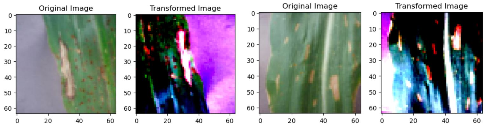
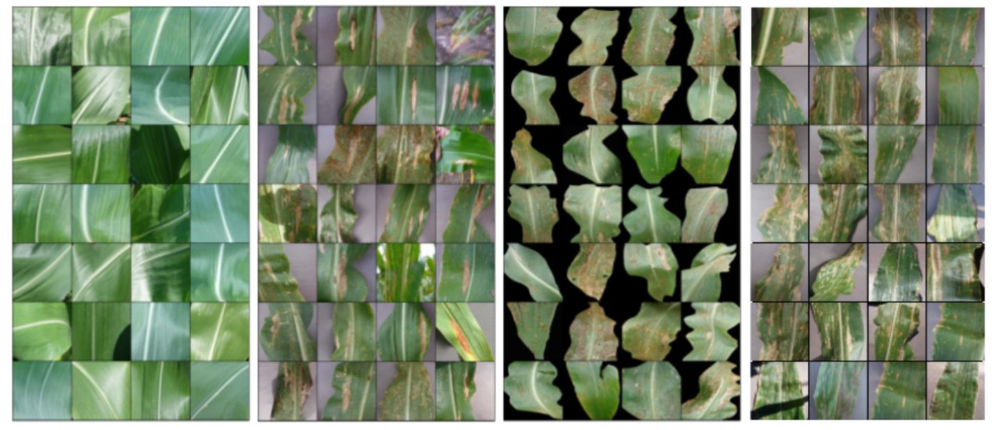
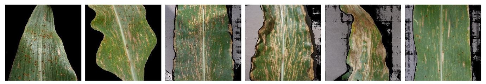
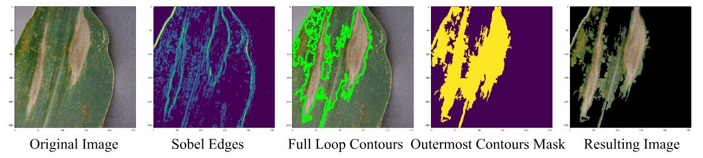
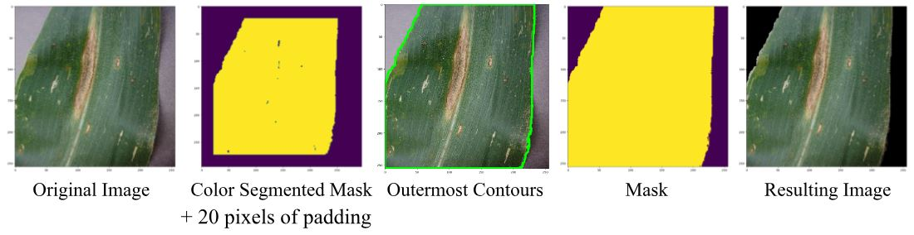
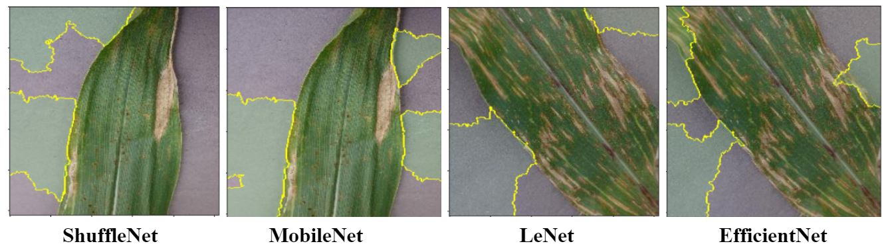
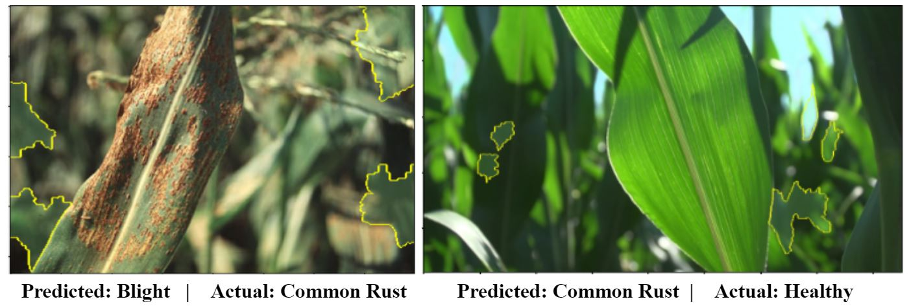
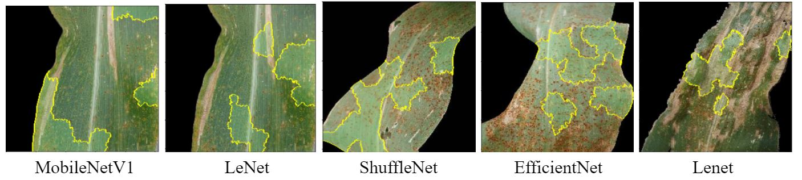
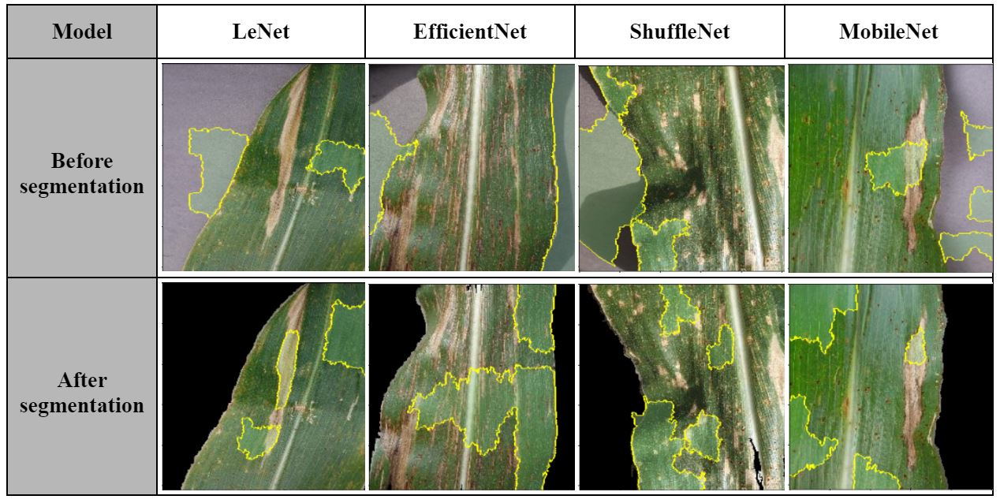

# Modeling Diseases in Corn Leaves Using Computer Vision

<strong>Find the rendered version of this write-up [here](https://github.com/Sam-B-Y/AI-Corn-Disease-Detection/blob/main/paper.pdf).</strong>

Sam Borremans <sup>\*1</sup>, Samuel Orellana Mateo<sup>\*1</sup>, Yash Singam <sup>\*1</sup>,  Samir Travers <sup>\*1</sup>, Benjamin Yan <sup>*1</sup>

_June 17, 2024_


# Abstract

This project explores the dual challenge of developing effective convolutional neural networks (CNNs) for disease detection in corn leaves and addressing critical issues in dataset quality. Utilizing the Maize Leaf Disease dataset, which contains around 4000 images categorized into four classes—three diseased and one healthy—we initially found that the models were prone to overfitting due to category-dependent backgrounds unique to each category. This paper details our efforts to design and compare CNN models, including ResNet, VGG16, EfficientNet, MobileNet, DenseNet, LeNet, and ShuffleNet, while simultaneously tackling the dataset's background uniformity problem. By employing color-based segmentation to standardize image backgrounds, we ensured that the models focused on the leaf features themselves. Our results demonstrate significant improvements in model accuracy and reliability, highlighting the importance of robust dataset preprocessing alongside advanced model architecture design for effective disease detection. 


---


<sup>*</sup>Equal Contribution.


 <sup>1</sup>Undergraduate student at Duke University.

Sam Borremans

[sam.borremans@duke.edu](mailto:sam.borremans@duke.edu)

Samuel Orellana Mateo

[samuel.orellanamateo@duke.edu](mailto:samuel.orellanamateo@duke.edu)

Yash Singam

[yash.singam@duke.edu](mailto:yash.singam@duke.edu)

Samir Travers

[samir.travers@duke.edu](mailto:samir.travers@duke.edu)

Benjamin Yan

[benjamin.yan@duke.edu](mailto:benjamin.yan@duke.edu)


# 1. Introduction

In 2022, the United States experienced a significant loss of around 380 million bushels of corn <sup>[1]</sup> due to various diseases. Specifically, 33.6 million bushels were lost to three aboveground diseases: common rust, gray leaf spot, and blight. These diseases can be identified by examining the leaves of affected plants, a relatively straightforward process. However, implementing field-wide coverage for detection, especially considering that corn fields averaged 725 acres in 2017 <sup>[2]</sup>, can be a slow and labor-intensive process. Therefore, we sought to build models utilizing computer vision technology to swiftly identify and flag unhealthy corn affected by the diseases mentioned above.

The three diseases were chosen because they are aboveground diseases and are particularly prevalent in the United States. The table below summarizes their effects, location, how they are detected, and their impact on quality:

 


<table>
  <tr>
   <td>
   </td>
   <td><strong>Common Rust<sup> [3][4]</sup></strong>
   </td>
   <td><strong>Gray Leaf Spot <sup>[5][6][7]</sup></strong>
   </td>
   <td><strong>Blight <sup>[8][9]</sup></strong>
   </td>
  </tr>
  <tr>
   <td><em>Effects</em>
   </td>
   <td>Under severe conditions, can lead to leaf chlorosis (yellowing) and early death.
   </td>
   <td>Reduces the photosynthetic area on leaves. Lesions may coalesce and kill leaves (grayish appearance due to fungal spores).
   </td>
   <td>Reduces the photosynthetic area on leaves. Lesions produce olive-green or black fungal spores (high humidity), visible with a hand lens
   </td>
  </tr>
  <tr>
   <td><em>Location</em>
   </td>
   <td>South U.S. and Mexico. Spreads to the north in summer through wind-carried spores. Found when the weather is cool (limited at 80◦ F) and moist.
   </td>
   <td>Primarily U.S. corn belt. Found in locations with wet and humid weather. Usually, the outbreaks are not widespread.
   </td>
   <td>Midwestern U.S. Found in locations with moderate temperatures (64 – 80 °F), wet and humid weather, or long periods of moisture.
   </td>
  </tr>
  <tr>
   <td><em>Detection</em>
   </td>
   <td>Small and either round or elongated brown pustules form on both leaf surfaces and other aboveground parts.
   </td>
   <td>Starts as small necrotic spots with halos on corn leaves and expands into rectangular gray-to-brown lesions with parallel edges.
   </td>
   <td>Canoe-shaped lesions, 1-6 inches long, initially bordered by gray-green margins before becoming tan-colored. Starts on lower leaves and spreads to upper ones.
   </td>
  </tr>
  <tr>
   <td><em>Impact on quality</em>
   </td>
   <td>May not have a direct impact in terms of grain characteristics, but can weaken plants and reduce overall yield.
   </td>
   <td>Can significantly affect yields, especially in susceptible hybrids, and can lead to rotting and lodging.
   </td>
   <td>Reduction in quality in sweet and silage corn, but minimal yield losses. Can become significant with susceptible hybrids or inbreds.
   </td>
  </tr>
</table>


**_Figure 1: Descriptions of the common rust, gray leaf spot, and blight diseases_**


# 2. Dataset

The data utilized in this study was sourced from the Corn or Maize Leaf Disease dataset <sup>[10]</sup>, which encompassed four distinct classes of corn leaves. One class represented healthy leaves, while the other classes consisted of leaves afflicted by each of the described diseases. The distribution of these categories is illustrated on the right.

All images were manually captured and exhibit variations in zoom level, dimensions, and orientation (both horizontal and vertical). Moreover, the backgrounds of the images vary; some feature other corn leaves, some have a gray background (typical in lab-controlled images), some exhibit a blurred background, and others lack a background altogether (black pixels). Consequently, a good model must be able to delineate the edges of the leaf in each image.


# 3. Models


### 3.1. Model Types

To detect and analyze corn leaves, our models employ neural networks, a common approach in computer vision. We opted for convolutional neural networks implemented using PyTorch <sup>[11]</sup>, and used the following models, based on existing literature exploring similar use cases:


<table>
  <tr>
   <td><strong>Model Name</strong>
   </td>
   <td><strong>Description of Literature</strong>
   </td>
  </tr>
  <tr>
   <td><em>ResNet<sup>  [12]</sup></em>
   </td>
   <td>Godi et al. utilized a ResNet model (ResNet 152 v2) to predict plant leaf diseases, achieving 95% accuracy on a dataset of 7000 images, surpassing previous models.
   </td>
  </tr>
  <tr>
   <td><em>VGG16 <sup>[13]</sup></em>
   </td>
   <td>Bhatt et al. used a VGG16 model to classify corn diseases in 2000 images and compare its performance to that of Inception-v2, ResNet50, and MobileNet-v1
   </td>
  </tr>
  <tr>
   <td><em>EfficientNet <sup>[14]</sup></em>
   </td>
   <td>Sun et al. leveraged FL-EfficientNet CNN architecture to classify corn diseases and compare its performance to that of ResNet50, DenseNet169
   </td>
  </tr>
  <tr>
   <td><em>LeNet <sup>[15]</sup></em>
   </td>
   <td>Wei et al. employed a LeNet-5 architecture to identify gases for electronic noses, achieving a final gas identification accuracy rate of 98.67%.
   </td>
  </tr>
  <tr>
   <td><em>ShuffleNet <sup>[16]</sup></em>
   </td>
   <td>Zhang et al. created an instance of the ShuffleNet CNN architecture optimized for mobile devices that use pointwise group convolution and channel shuffle.
   </td>
  </tr>
  <tr>
   <td><em>DenseNet <sup>[17]</sup></em>
   </td>
   <td>Gao et al. designed a DenseNet architecture utilizing a feed-forward design with connections between all the layers to achieve high accuracy.
   </td>
  </tr>
  <tr>
   <td><em>MobileNet <sup>[18]</sup></em>
   </td>
   <td>Howard et al. utilized a MobileNet for mobile and embedded vision applications.
   </td>
  </tr>
</table>


**_Figure 3: Descriptions of models and sources_**


### 3.2. Measuring Performance

To evaluate the performance of the models, we compared their performance on a test set using metrics such as accuracy, recall, precision, and F-score (F1), defined as:

```math
Accuracy = \frac{\text{True Predictions}}{\text{Size of Set}}
```

```math
\text{Precision of a category} = \frac{\text{True Predictions of the category}}{\text{Size of predicted set of that category}}
```

```math
\text{Recall of a category} = \frac{\text{True Predictions of the category}}{\text{True set size of that category}}
```

```math
F1 = \frac{2}{\frac{1}{Precision} + \frac{1}{Recall}}
```

where _True Predictions_ is defined as all correct predictions in the 4 categories.


# 4. Data Processing and Augmentation


### 4.1. Data Augmentation

We added flipping transformation to the images to increase the robustness of the model as images might sometimes be oriented differently, using RandomHorizontalFlip and RandomVerticalFlip. Furthermore, since our dataset included images with different dimensions, the images were standardized before the models were trained. We thus resized the images using the Resize function of torch transformations (where we used the smallest image dimensions, 64 x 64), by using `transforms.Resize(size=(64, 64)`). Based on existing research that involves detecting carrot diseases using CNNs <sup>[19]</sup>, we also found that we can use the Gaussian Blur transformation to remove Gaussian Noise to minimize image noise from different sources without hampering other features. However, this transformation was already applied when we resized the images, meaning we did not need to reapply it.





**_Figure 4: Images of corn leaf blight before and after data augmentation is applied_**


### 4.2. Problems With the Dataset

After initially inspecting the different pictures in our dataset, a certain problem became very visible. As shown in the figure below, the type of leaf in a picture can easily be identified based on the color of the background: leaves with blight or gray leaf spots have a light purple background, leaves with common rust have a black background and healthy leaves are mostly zoomed in and do not have a background. This relationship indicates that the color of the background could end up being used by the CNN model, making it highly dependent on the wrong features of the image and ultimately useless–a hypothesis we examined and confirmed later on in the research process. We considered several approaches to fix this problem: using grayscale versions of the images  (which we rapidly discarded as the diseases can be recognized by the color of the leaf and we would lose a lot of information), zooming in enough to eliminate the background, or standardizing the background color across all diseases.




**_Figure 5: 28 randomly selected “healthy”, “blight”, “common rust” and “gray leaf spot” leave pictures_**

We chose the last option as the visible indicators of diseases on the leaves vary in their location from leaf to leaf, necessitating manual zooming on each leaf. Given the impracticality of individually processing images in a large dataset, we decided to remove the backgrounds from all images and replace them with a black background.


### 4.3. Background Removal

We tried several methods to remove the backgrounds of the leaves. The first involved using the existing Segment Anything AI model from Meta AI <sup>[20]</sup> to automate background removal with no help. Although the model successfully removed the backgrounds of most images, around 1/5 of the images still had most of their background, as shown below. 



**_Figure 6: 2 successfully removed backgrounds and 4 unsuccessfully removed backgrounds using Segment Anything, all pictures out of the “Gray Leaf Spot” category_**

This was likely due to the non-uniform backgrounds and the leaves covering a large portion of the picture, which may have caused the model to struggle in determining where to focus within the image.

The second attempt involved edge detection, for which we tried using the OpenCV library to implement the Sobel Edge detection algorithm. However, the fact that the leaf wasn’t entirely in the picture caused trouble, as the model couldn’t detect the edge of the leaves connected to the sides of the picture. We tried adding light purple padding to the image, but because the model’s background wasn’t uniform, we couldn’t find a sensitivity where it wouldn’t differentiate between the padding, background, and sides of the leaf. In the image below, the algorithm correctly finds the leaf’s edges but fails to convert it to the wanted contours since the left, top, and bottom sides of the leaf aren’t completely visible and thus it does not detect an edge there. Although for this specific image, it would be possible to make an algorithm connect two edges at the top and the bottom, this method would not work more generally because leaves could have no edge on the left side (i.e. be completely out of frame on the left).




**_Figure 7: Example of the background removal process of a “Gray Leaf Spot” image using edge detection_**

We thus decided to use color-based segmentation to mask green, brown, and yellow pixels in the image and remove any other pixels. This was also done with OpenCV by first converting the pictures from RGB to HSV before creating a temporary mask. The mask was then converted to contours with the Segment Anything method’s padding technique: we took the mask, added 20 pixels of padding around the image, then took the outermost contours, removed the 20 pixels of padding, and converted it into a mask.




**_Figure 8: Example of the background removal process of a “Gray Leaf Spot” image using color-based segmentation_**


# 5 Models


### 5.1. Preliminary Model Performances

In order to see how much the models would overfit the backgrounds, we first trained the models on the original images. This section will be looking at those models exclusively.

The trained models are described in Figure 3. They were trained using 30 Epochs, and L2 Regularization with a training set of 70% of the original dataset and a validation set of 20%. The models were then analyzed with the test set, which contains the remaining 10% of the dataset. 

Original model performances on the test set were strong, as shown by the first column below. However, when we added pictures with backgrounds that did not align with the patterns illustrated in Figure 5 (those images will be referred to as images with “different backgrounds”), accuracies dropped significantly, indicating that our models heavily overfitted  to the backgrounds of the images:


<table>
  <tr>
   <td><strong>Model</strong>
   </td>
   <td><strong>Accuracy on test set</strong>
   </td>
   <td><strong>Accuracy on different background test set</strong>
   </td>
   <td><strong>Total Accuracy (weighted average of both)</strong>
   </td>
  </tr>
  <tr>
   <td><em>ResNet 50</em>
   </td>
   <td>0.841
   </td>
   <td>0.262
   </td>
   <td>0.649
   </td>
  </tr>
  <tr>
   <td><em>ResNet 101</em>
   </td>
   <td>0.807
   </td>
   <td>0.357 
   </td>
   <td>0.635
   </td>
  </tr>
  <tr>
   <td><em>ResNet 152</em>
   </td>
   <td>0.820
   </td>
   <td>0.371
   </td>
   <td>0.671
   </td>
  </tr>
  <tr>
   <td><em>VGG16</em>
   </td>
   <td>0.818
   </td>
   <td>0.347
   </td>
   <td>0.642
   </td>
  </tr>
  <tr>
   <td><em>EfficientNet</em>
   </td>
   <td>0.890
   </td>
   <td>0.490
   </td>
   <td>0.738
   </td>
  </tr>
  <tr>
   <td><em>MobileNet</em>
   </td>
   <td>0.891
   </td>
   <td>0.506
   </td>
   <td>0.744
   </td>
  </tr>
  <tr>
   <td><em>DenseNet</em>
   </td>
   <td>0.906
   </td>
   <td>0.433
   </td>
   <td>0.725
   </td>
  </tr>
  <tr>
   <td><em>LeNet</em>
   </td>
   <td>0.862
   </td>
   <td>0.283
   </td>
   <td>0.645
   </td>
  </tr>
  <tr>
   <td><em>ShuffleNet</em>
   </td>
   <td>0.908
   </td>
   <td>0.440
   </td>
   <td>0.728
   </td>
  </tr>
</table>


**_Figure 9: Accuracies of models trained on the original dataset_**

Although certain models performed relatively well on the test set, their poor performance on the test set with different backgrounds prevents them from becoming viable implementations of the technology—a model that can only make good predictions when the background gives away the right classification is not useful.

The models’ difficulty with gray leaf spot images, indicated by the recall for this category, also indicates overfitting as these images were commonly misclassified as blight, which has similarly colored backgrounds in the dataset (see Figure 5).


<table>
  <tr>
   <td><strong>ResNet</strong>
<p>
<strong>50</strong>
   </td>
   <td><strong>ResNet</strong>
<p>
<strong>101</strong>
   </td>
   <td><strong>ResNet</strong>
<p>
<strong>152</strong>
   </td>
   <td><strong>VGG</strong>
<p>
<strong>16</strong>
   </td>
   <td><strong>Efficient</strong>
<p>
<strong>Net</strong>
   </td>
   <td><strong>Mobile</strong>
<p>
<strong>Net</strong>
   </td>
   <td><strong>Dense</strong>
<p>
<strong>Net</strong>
   </td>
   <td><strong>LeNet</strong>
   </td>
   <td><strong>Shuffle</strong>
<p>
<strong>Net</strong>
   </td>
  </tr>
  <tr>
   <td>0.482
   </td>
   <td>0.000
   </td>
   <td>0.156
   </td>
   <td>0.156
   </td>
   <td>0.298
   </td>
   <td>0.418
   </td>
   <td>0.440
   </td>
   <td>0.206
   </td>
   <td>0.440
   </td>
  </tr>
</table>


**_Figure 10: Recall for the Gray Leaf Spot category of the original test set _**


### 5.2. Understanding Models

Deconvolution tools such as LIME (Local Interpretable Model-Agnostic Explanations) <sup>[21] [22]</sup> make the problem even more apparent. By repeatedly altering some specific parts of the image, the tool can find the areas of the picture that influence the model’s decision the most. These areas are then given a yellow boundary and highlighted with green for emphasis. The results speak for themselves. As shown in the following pictures, the models use the background extensively in their decision-making processes, leading them to wrongly classify the image on the right as blight instead of gray leaf spot. 




**_Figure 11: LIME applied to two images for two different models each._**


The models seem to struggle even more with the pictures without the standard backgrounds (purple for blight and gray leaf spot, black for common rust, and none for healthy leaves). EfficientNet predicted the leaf on the right to have blight, although it has visible rust. The image on the right was classified as containing rust by the model, although it is completely healthy.





**_Figure 12: LIME applied to two images with different backgrounds_**


### 5.3. Re-Trained Model Performances

Following image segmentation, we retrained our models using the same parameters. Note that as all backgrounds were now standardized, there was no point in testing the models on the images with different backgrounds. We thus examined their overall accuracy exclusively. 


<table>
  <tr>
   <td><strong>ResNet</strong>
<p>
<strong>50</strong>
   </td>
   <td><strong>ResNet</strong>
<p>
<strong>101</strong>
   </td>
   <td><strong>ResNet</strong>
<p>
<strong>152</strong>
   </td>
   <td><strong>VGG</strong>
<p>
<strong>16</strong>
   </td>
   <td><strong>Efficient</strong>
<p>
<strong>Net</strong>
   </td>
   <td><strong>Mobile</strong>
<p>
<strong>Net</strong>
   </td>
   <td><strong>Dense</strong>
<p>
<strong>Net</strong>
   </td>
   <td><strong>LeNet</strong>
   </td>
   <td><strong>Shuffle</strong>
<p>
<strong>Net</strong>
   </td>
  </tr>
  <tr>
   <td>0.787
   </td>
   <td>0.838
   </td>
   <td>0.782
   </td>
   <td>0.758
   </td>
   <td>0.804
   </td>
   <td>0.877
   </td>
   <td>0.891
   </td>
   <td>0.827
   </td>
   <td>0.874
   </td>
  </tr>
  <tr>
   <td>0.138▲
   </td>
   <td>0.203▲
   </td>
   <td>0.111▲
   </td>
   <td>0.116▲
   </td>
   <td>0.066▲
   </td>
   <td>0.133▲
   </td>
   <td>0.166▲
   </td>
   <td>0.182▲
   </td>
   <td>0.146▲
   </td>
  </tr>
</table>


**_Figure 13: Accuracy of the models after training on a segmented dataset_**

As shown in the figure above, all models improved after training on the segmented dataset, with ResNet101 getting the biggest improvement of 20.3%, and DenseNet reaching the highest accuracy of 89.1%.


### 5.4. Understanding New Models




**_Figure 14: Lime applied to different models and segmented images_**

Again, we used Lime to better understand the new models’ performance. As seen in the images above, the new models learned to focus exclusively on features of the leaf to correctly classify the images, as the background was standardized and provided no information that would be helpful. Removing the background from the model’s decision-making process also allowed it to do a better job distinguishing between blight and gray leaf spot, as shown in the last picture above.

Additionally, we can directly compare models before and after training on segmented backgrounds. When put side by side in the table below, the improvement is obvious: all models trained on segmented backgrounds use parts of the leaves exclusively. 





**_Figure 15: Understand model performance before versus after segmentation with Lime_**

Furthermore, upon closer inspection, the regions highlighted by LIME include the parts of the leaf where the disease is the most visible, indicating that the model is using the correct features of the images to make its decisions. This is another improvement over the original models.


# 6. Conclusion and Future Work

In this study, we sought to create effective models for disease classification in corn leaves while also addressing the challenges posed by the Maize Leaf Disease dataset. We experimented with various neural network architectures, including ResNet, VGG16, EfficientNet, MobileNet, DenseNet, LeNet, and ShuffleNet. However, this dataset presented a significant issue: images were categorized by disease with distinct backgrounds unique to each category. Consequently, our initial models overly relied on these backgrounds, resulting in poor generalization when the backgrounds were not standard. 

To address this, we standardized the backgrounds of the images, ensuring the models focused on the leaves themselves. We tried several methods and decided on using color-based segmentation, which returned the most consistent results. Our newly trained models demonstrated a notable improvement in model performance once the backgrounds were removed, as evidenced by higher accuracies and recall across the board. This improvement was especially visible when the deconvolution tool LIME was used, as we were able to confirm that the models trained on standardized backgrounds relied on relevant leaf features rather than extraneous background information. 

In conclusion, this study highlights the critical role of a large and diverse dataset and proper preprocessing in training effective deep-learning models. By standardizing the backgrounds, we ensured the models could generalize better and make accurate predictions based on the actual diseased areas of the corn leaves. This approach can be extended to other agricultural datasets and diseases, paving the way for more reliable and efficient disease detection systems in the future. 

As a next step, we could review the architecture of the models we used, experimenting with different optimization and L2 regularization. Furthermore, we could also consider using transfer learning of existing agricultural models that worked for other types of leaves, as this would deal with the fact that the dataset we used is too small. It could also help with overfitting to the backgrounds. If possible, however, the best solution would probably involve expanding the dataset and incorporating more diverse backgrounds to enhance model robustness in real-world scenarios.


# 


# 7. References


<ol>

<li>Mueller, Daren, et al. “Corn Disease Loss Estimates from the United States and Ontario, Canada - 2022.” Crop Protection Network, 6 Feb. 2023. 

<li>Saavoss, Monica, et al. “Trends in Production Practices and Costs of the U.S. Corn Sector.” Economic Research Report Number 294, USDA Economic Research Service, U.S. Department of Agriculture, July 2021

<li>“Common Rust.” <em>Cornell College of Agriculture and Life Sciences</em>, CALS.

<li>Jackson-Ziems, Tamara A. “Rust Diseases of Corn in Nebraska.” Nebraska Extension Publications, University of Nebraska-Lincoln, Jan. 2014.

<li>Malvick, Dean. “Gray Leaf Spot on Corn.” UMN Extension, University of Minnesota, 2018.

<li>“Gray Leaf Spot.” <em>Cornell College of Agriculture and Life Sciences</em>, CALS.

<li>Wise, Kiersten. “Gray Leaf Spot.” Purdue Extension, Purdue University.

<li>Malvick, Dean. “Gray Leaf Spot on Corn.” UMN Extension, University of Minnesota, 2018.

<li>Wise, Kiersten. “Northern Corn Leaf Blight.” Purdue Extension, Purdue University

<li>Ghose, Smaranjit. “Corn or Maize Leaf Disease Dataset.” Artificial Intelligence Based Classification of Diseases in Maize/Corn Plants, 11 Nov. 2020.

<li>Paszke, Adam, et al. ‘PyTorch: An Imperative Style, High-Performance Deep Learning Library’. Advances in Neural Information Processing Systems 32, Curran Associates, Inc., 2019, pp. 8024–8035.

<li>Godi, Brahmaji et al. "ResNet Model to Forecast Plant Leaf Disease." <em>Computer Science & Engineering</em>, Raghu Institute of Technology, Visakhapatnam, India, 2024. <em>IEEE Xplore</em>.
</li>

<li>Bhatt, Prakruti V. et al. “Identification of Diseases in Corn Leaves using Convolutional Neural Networks and Boosting.” International Conference on Pattern Recognition Applications and Methods (2019).

<li>Sun, Xuewei, et al. “Research on plant disease identification based on CNN.” Cognitive Robotics, vol. 2, 2022, pp. 155–163.

<li>Wei, Guangfen et al. “Development of a LeNet-5 Gas Identification CNN Structure for Electronic Noses.” Sensors (Basel, Switzerland) vol. 19,1 217. 8 Jan. 2019, doi:10.3390/s19010217

<li> Zhang, Xiangyue, et al. “ShuffleNet: An Extremely Efficient Convolutional Neural Network for Mobile Devices.” ArXiv, 7 Dec. 2017, arxiv.org/pdf/1707.01083

<li>Huang, Gao, et al. “Densely Connected Convolutional Networks.” arXiv preprint arXiv:1608.06993 (2018).

<li>Howard, Andrew G, et al. “MobileNets: Efficient Convolutional Neural Networks for Mobile Vision Applications.” ArXiv, 17 Apr 2017, arxiv.org/pdf/1704.04861.

<li>Ray, Shree. Dolax, et al. ‘Carrot Cure: A CNN Based Application to Detect Carrot Disease’. 2022 6th International Conference on Trends in Electronics and Informatics (ICOEI), IEEE, 2022, pp. 01–07. DOI.org (Crossref).

<li>Kirillov, Alexander, et al. “Segment Anything.” ArXiv, Meta AI Research, FAIR, 5 Apr. 2023, arxiv.org/pdf/2304.02643.pdf. 

<li>​​Ribeiro, Marco, et al. “Why Should I Trust You?” Explaining the Predictions of Any Classifier. ArXiv, 16 Feb 2016, arxiv.org/pdf/1602.04938v1.

<li>Ribeiro, Marco, et al. “Local Interpretable Model-Agnostic Explanations (LIME): An Introduction.” O’Reilly Media, 12 Aug. 2016, www.oreilly.com/content/introduction-to-local-interpretable-model-agnostic-explanations-lime/.
</li>
</ol>


# 8. Appendix


### 8.1 Confusion Matrices for Models Trained on Non-Segmented Backgrounds, Test Set


<table>
  <tr>
   <td>
   </td>
   <td>
   </td>
   <td colspan="4" ><strong>                       ResNet50</strong>
   </td>
   <td>
   </td>
  </tr>
  <tr>
   <td rowspan="4" >Actual
   </td>
   <td>Blight
   </td>
   <td>96
   </td>
   <td>0
   </td>
   <td>19
   </td>
   <td>0
   </td>
   <td>
   </td>
  </tr>
  <tr>
   <td>Common_Rust
   </td>
   <td>10
   </td>
   <td>117
   </td>
   <td>4
   </td>
   <td>0
   </td>
   <td>
   </td>
  </tr>
  <tr>
   <td>Gray_Leaf_Spot
   </td>
   <td>25
   </td>
   <td>1
   </td>
   <td>33
   </td>
   <td>0
   </td>
   <td>
   </td>
  </tr>
  <tr>
   <td>Healthy
   </td>
   <td>8
   </td>
   <td>0
   </td>
   <td>0
   </td>
   <td>109
   </td>
   <td>
   </td>
  </tr>
  <tr>
   <td>
   </td>
   <td>
   </td>
   <td>Blight
   </td>
   <td>Common_Rust
   </td>
   <td>Gray_Leaf_Spot
   </td>
   <td>Healthy
   </td>
   <td>
   </td>
  </tr>
  <tr>
   <td>
   </td>
   <td>
   </td>
   <td colspan="4" >                       Predicted
   </td>
   <td>
   </td>
  </tr>
</table>


<table>
  <tr>
   <td>
   </td>
   <td>
   </td>
   <td colspan="4" ><strong>                       ResNet101</strong>
   </td>
  </tr>
  <tr>
   <td rowspan="4" >Actual
   </td>
   <td>Blight
   </td>
   <td>113
   </td>
   <td>0
   </td>
   <td>1
   </td>
   <td>2
   </td>
  </tr>
  <tr>
   <td>Common_Rust
   </td>
   <td>11
   </td>
   <td>116
   </td>
   <td>2
   </td>
   <td>4
   </td>
  </tr>
  <tr>
   <td>Gray_Leaf_Spot
   </td>
   <td>57
   </td>
   <td>0
   </td>
   <td>0
   </td>
   <td>2
   </td>
  </tr>
  <tr>
   <td>Healthy
   </td>
   <td>3
   </td>
   <td>0
   </td>
   <td>0
   </td>
   <td>114
   </td>
  </tr>
  <tr>
   <td>
   </td>
   <td>
   </td>
   <td>Blight
   </td>
   <td>Common_Rust
   </td>
   <td>Gray_Leaf_Spot
   </td>
   <td>Healthy
   </td>
  </tr>
  <tr>
   <td>
   </td>
   <td>
   </td>
   <td colspan="4" >                       Predicted
   </td>
  </tr>
</table>


<table>
  <tr>
   <td>
   </td>
   <td>
   </td>
   <td colspan="4" ><strong>                       ResNet152</strong>
   </td>
  </tr>
  <tr>
   <td rowspan="4" >Actual
   </td>
   <td>Blight
   </td>
   <td>89
   </td>
   <td>11
   </td>
   <td>11
   </td>
   <td>4
   </td>
  </tr>
  <tr>
   <td>Common_Rust
   </td>
   <td>3
   </td>
   <td>126
   </td>
   <td>1
   </td>
   <td>1
   </td>
  </tr>
  <tr>
   <td>Gray_Leaf_Spot
   </td>
   <td>26
   </td>
   <td>17
   </td>
   <td>15
   </td>
   <td>1
   </td>
  </tr>
  <tr>
   <td>Healthy
   </td>
   <td>0
   </td>
   <td>1
   </td>
   <td>0
   </td>
   <td>116
   </td>
  </tr>
  <tr>
   <td>
   </td>
   <td>
   </td>
   <td>Blight
   </td>
   <td>Common_Rust
   </td>
   <td>Gray_Leaf_Spot
   </td>
   <td>Healthy
   </td>
  </tr>
  <tr>
   <td>
   </td>
   <td>
   </td>
   <td colspan="4" >                       Predicted
   </td>
  </tr>
</table>


<table>
  <tr>
   <td>
   </td>
   <td>
   </td>
   <td colspan="4" ><strong>                       VGG16</strong>
   </td>
  </tr>
  <tr>
   <td rowspan="4" >Actual
   </td>
   <td>Blight
   </td>
   <td>110
   </td>
   <td>1
   </td>
   <td>3
   </td>
   <td>1
   </td>
  </tr>
  <tr>
   <td>Common_Rust
   </td>
   <td>9
   </td>
   <td>115
   </td>
   <td>6
   </td>
   <td>1
   </td>
  </tr>
  <tr>
   <td>Gray_Leaf_Spot
   </td>
   <td>45
   </td>
   <td>5
   </td>
   <td>8
   </td>
   <td>1
   </td>
  </tr>
  <tr>
   <td>Healthy
   </td>
   <td>4
   </td>
   <td>1
   </td>
   <td>0
   </td>
   <td>112
   </td>
  </tr>
  <tr>
   <td>
   </td>
   <td>
   </td>
   <td>Blight
   </td>
   <td>Common_Rust
   </td>
   <td>Gray_Leaf_Spot
   </td>
   <td>Healthy
   </td>
  </tr>
  <tr>
   <td>
   </td>
   <td>
   </td>
   <td colspan="4" >                       Predicted
   </td>
  </tr>
</table>


<table>
  <tr>
   <td>
   </td>
   <td>
   </td>
   <td colspan="4" ><strong>                      EfficientNet</strong>
   </td>
   <td>
   </td>
  </tr>
  <tr>
   <td rowspan="4" >Actual
   </td>
   <td>Blight
   </td>
   <td>109
   </td>
   <td>5
   </td>
   <td>1
   </td>
   <td>0
   </td>
   <td>
   </td>
  </tr>
  <tr>
   <td>Common_Rust
   </td>
   <td>4
   </td>
   <td>123
   </td>
   <td>1
   </td>
   <td>1
   </td>
   <td>
   </td>
  </tr>
  <tr>
   <td>Gray_Leaf_Spot
   </td>
   <td>27
   </td>
   <td>7
   </td>
   <td>25
   </td>
   <td>0
   </td>
   <td>
   </td>
  </tr>
  <tr>
   <td>Healthy
   </td>
   <td>0
   </td>
   <td>0
   </td>
   <td>0
   </td>
   <td>117
   </td>
   <td>
   </td>
  </tr>
  <tr>
   <td>
   </td>
   <td>
   </td>
   <td>Blight
   </td>
   <td>Common_Rust
   </td>
   <td>Gray_Leaf_Spot
   </td>
   <td>Healthy
   </td>
   <td>
   </td>
  </tr>
  <tr>
   <td>
   </td>
   <td>
   </td>
   <td colspan="4" >                       Predicted
   </td>
   <td>
   </td>
  </tr>
</table>


<table>
  <tr>
   <td>
   </td>
   <td>
   </td>
   <td colspan="4" ><strong>                       MobileNet</strong>
   </td>
  </tr>
  <tr>
   <td rowspan="4" >Actual
   </td>
   <td>Blight
   </td>
   <td>100
   </td>
   <td>3
   </td>
   <td>12
   </td>
   <td>0
   </td>
  </tr>
  <tr>
   <td>Common_Rust
   </td>
   <td>6
   </td>
   <td>124
   </td>
   <td>1
   </td>
   <td>0
   </td>
  </tr>
  <tr>
   <td>Gray_Leaf_Spot
   </td>
   <td>13
   </td>
   <td>10
   </td>
   <td>36
   </td>
   <td>0
   </td>
  </tr>
  <tr>
   <td>Healthy
   </td>
   <td>0
   </td>
   <td>1
   </td>
   <td>0
   </td>
   <td>116
   </td>
  </tr>
  <tr>
   <td>
   </td>
   <td>
   </td>
   <td>Blight
   </td>
   <td>Common_Rust
   </td>
   <td>Gray_Leaf_Spot
   </td>
   <td>Healthy
   </td>
  </tr>
  <tr>
   <td>
   </td>
   <td>
   </td>
   <td colspan="4" >                       Predicted
   </td>
  </tr>
</table>


<table>
  <tr>
   <td>
   </td>
   <td>
   </td>
   <td colspan="4" ><strong>                       DenseNet</strong>
   </td>
  </tr>
  <tr>
   <td rowspan="4" >Actual
   </td>
   <td>Blight
   </td>
   <td>110
   </td>
   <td>1
   </td>
   <td>4
   </td>
   <td>1
   </td>
  </tr>
  <tr>
   <td>Common_Rust
   </td>
   <td>5
   </td>
   <td>126
   </td>
   <td>0
   </td>
   <td>2
   </td>
  </tr>
  <tr>
   <td>Gray_Leaf_Spot
   </td>
   <td>22
   </td>
   <td>3
   </td>
   <td>33
   </td>
   <td>1
   </td>
  </tr>
  <tr>
   <td>Healthy
   </td>
   <td>1
   </td>
   <td>0
   </td>
   <td>0
   </td>
   <td>116
   </td>
  </tr>
  <tr>
   <td>
   </td>
   <td>
   </td>
   <td>Blight
   </td>
   <td>Common_Rust
   </td>
   <td>Gray_Leaf_Spot
   </td>
   <td>Healthy
   </td>
  </tr>
  <tr>
   <td>
   </td>
   <td>
   </td>
   <td colspan="4" >                       Predicted
   </td>
  </tr>
</table>


<table>
  <tr>
   <td>
   </td>
   <td>
   </td>
   <td colspan="4" ><strong>                       LeNet</strong>
   </td>
  </tr>
  <tr>
   <td rowspan="4" >Actual
   </td>
   <td>Blight
   </td>
   <td>112
   </td>
   <td>0
   </td>
   <td>2
   </td>
   <td>1
   </td>
  </tr>
  <tr>
   <td>Common_Rust
   </td>
   <td>10
   </td>
   <td>119
   </td>
   <td>2
   </td>
   <td>0
   </td>
  </tr>
  <tr>
   <td>Gray_Leaf_Spot
   </td>
   <td>36
   </td>
   <td>5
   </td>
   <td>18
   </td>
   <td>0
   </td>
  </tr>
  <tr>
   <td>Healthy
   </td>
   <td>1
   </td>
   <td>1
   </td>
   <td>0
   </td>
   <td>113
   </td>
  </tr>
  <tr>
   <td>
   </td>
   <td>
   </td>
   <td>Blight
   </td>
   <td>Common_Rust
   </td>
   <td>Gray_Leaf_Spot
   </td>
   <td>Healthy
   </td>
  </tr>
  <tr>
   <td>
   </td>
   <td>
   </td>
   <td colspan="4" >                       Predicted
   </td>
  </tr>
</table>


<table>
  <tr>
   <td>
   </td>
   <td>
   </td>
   <td colspan="4" ><strong>                       ShuffleNet</strong>
   </td>
  </tr>
  <tr>
   <td rowspan="4" >Actual
   </td>
   <td>Blight
   </td>
   <td>105
   </td>
   <td>0
   </td>
   <td>0
   </td>
   <td>1
   </td>
  </tr>
  <tr>
   <td>Common_Rust
   </td>
   <td>7
   </td>
   <td>122
   </td>
   <td>1
   </td>
   <td>1
   </td>
  </tr>
  <tr>
   <td>Gray_Leaf_Spot
   </td>
   <td>24
   </td>
   <td>2
   </td>
   <td>32
   </td>
   <td>1
   </td>
  </tr>
  <tr>
   <td>Healthy
   </td>
   <td>1
   </td>
   <td>0
   </td>
   <td>0
   </td>
   <td>116
   </td>
  </tr>
  <tr>
   <td>
   </td>
   <td>
   </td>
   <td>Blight
   </td>
   <td>Common_Rust
   </td>
   <td>Gray_Leaf_Spot
   </td>
   <td>Healthy
   </td>
  </tr>
  <tr>
   <td>
   </td>
   <td>
   </td>
   <td colspan="4" >                       Predicted
   </td>
  </tr>
</table>


### 8.2 Performance Metrics for Models Trained on Non-Segmented Backgrounds, Test Set

**ResNet50**


<table>
  <tr>
   <td><strong>Accuracy:</strong>
   </td>
   <td>0.841
   </td>
   <td>
   </td>
   <td>
   </td>
   <td>
   </td>
   <td>
   </td>
  </tr>
  <tr>
   <td><strong>Precision for Blight:</strong>
   </td>
   <td>0.691
   </td>
   <td><strong>Recall for Blight:</strong>
   </td>
   <td>0.835
   </td>
   <td><strong>F1 Blight:</strong>
   </td>
   <td>0.756
   </td>
  </tr>
  <tr>
   <td><strong>Precision for Common Rust:</strong>
   </td>
   <td>0.992
   </td>
   <td><strong>Recall for Common Rust:</strong>
   </td>
   <td>0.893
   </td>
   <td><strong>F1 Common Rust:</strong>
   </td>
   <td>0.940
   </td>
  </tr>
  <tr>
   <td><strong>Precision for Gray Leaf Spot:</strong>
   </td>
   <td>0.589
   </td>
   <td><strong>Recall for Gray Leaf Spot:</strong>
   </td>
   <td>0.559
   </td>
   <td><strong>F1 Gray Leaf Spot:</strong>
   </td>
   <td>0.574
   </td>
  </tr>
  <tr>
   <td><strong>Precision for Healthy:</strong>
   </td>
   <td>1.000
   </td>
   <td><strong>Recall for Healthy:</strong>
   </td>
   <td>0.932
   </td>
   <td><strong>F1 Healthy:</strong>
   </td>
   <td>0.965
   </td>
  </tr>
</table>


**ResNet101**


<table>
  <tr>
   <td><strong>Accuracy:</strong>
   </td>
   <td><p style="text-align: right">
0.807</p>

   </td>
   <td>
   </td>
   <td>
   </td>
   <td>
   </td>
   <td>
   </td>
  </tr>
  <tr>
   <td><strong>Precision for Blight:</strong>
   </td>
   <td><p style="text-align: right">
0.614</p>

   </td>
   <td><strong>Recall for Blight:</strong>
   </td>
   <td><p style="text-align: right">
0.974</p>

   </td>
   <td><strong>F1 Blight:</strong>
   </td>
   <td><p style="text-align: right">
0.753</p>

   </td>
  </tr>
  <tr>
   <td><strong>Precision for Common Rust:</strong>
   </td>
   <td><p style="text-align: right">
1.000</p>

   </td>
   <td><strong>Recall for Common Rust:</strong>
   </td>
   <td><p style="text-align: right">
0.872</p>

   </td>
   <td><strong>F1 Common Rust:</strong>
   </td>
   <td><p style="text-align: right">
0.932</p>

   </td>
  </tr>
  <tr>
   <td><strong>Precision for Gray Leaf Spot:</strong>
   </td>
   <td><p style="text-align: right">
0.000</p>

   </td>
   <td><strong>Recall for Gray Leaf Spot:</strong>
   </td>
   <td><p style="text-align: right">
0.000</p>

   </td>
   <td><strong>F1 Gray Leaf Spot:</strong>
   </td>
   <td><p style="text-align: right">
0.000</p>

   </td>
  </tr>
  <tr>
   <td><strong>Precision for Healthy:</strong>
   </td>
   <td><p style="text-align: right">
0.934</p>

   </td>
   <td><strong>Recall for Healthy:</strong>
   </td>
   <td><p style="text-align: right">
0.974</p>

   </td>
   <td><strong>F1 Healthy:</strong>
   </td>
   <td><p style="text-align: right">
0.954</p>

   </td>
  </tr>
</table>


**ResNet152**


<table>
  <tr>
   <td><strong>Accuracy:</strong>
   </td>
   <td><p style="text-align: right">
0.820</p>

   </td>
   <td>
   </td>
   <td>
   </td>
   <td>
   </td>
   <td>
   </td>
  </tr>
  <tr>
   <td><strong>Precision for Blight:</strong>
   </td>
   <td><p style="text-align: right">
0.754</p>

   </td>
   <td><strong>Recall for Blight:</strong>
   </td>
   <td><p style="text-align: right">
0.774</p>

   </td>
   <td><strong>F1 Blight:</strong>
   </td>
   <td><p style="text-align: right">
0.764</p>

   </td>
  </tr>
  <tr>
   <td><strong>Precision for Common Rust:</strong>
   </td>
   <td><p style="text-align: right">
0.813</p>

   </td>
   <td><strong>Recall for Common Rust:</strong>
   </td>
   <td><p style="text-align: right">
0.962</p>

   </td>
   <td><strong>F1 Common Rust:</strong>
   </td>
   <td><p style="text-align: right">
0.881</p>

   </td>
  </tr>
  <tr>
   <td><strong>Precision for Gray Leaf Spot:</strong>
   </td>
   <td><p style="text-align: right">
0.556</p>

   </td>
   <td><strong>Recall for Gray Leaf Spot:</strong>
   </td>
   <td><p style="text-align: right">
0.254</p>

   </td>
   <td><strong>F1 Gray Leaf Spot:</strong>
   </td>
   <td><p style="text-align: right">
0.349</p>

   </td>
  </tr>
  <tr>
   <td><strong>Precision for Healthy:</strong>
   </td>
   <td><p style="text-align: right">
0.951</p>

   </td>
   <td><strong>Recall for Healthy:</strong>
   </td>
   <td><p style="text-align: right">
0.991</p>

   </td>
   <td><strong>F1 Healthy:</strong>
   </td>
   <td><p style="text-align: right">
0.971</p>

   </td>
  </tr>
</table>


**VGG16**


<table>
  <tr>
   <td><strong>Accuracy:</strong>
   </td>
   <td><p style="text-align: right">
0.818</p>

   </td>
   <td>
   </td>
   <td>
   </td>
   <td>
   </td>
   <td>
   </td>
  </tr>
  <tr>
   <td><strong>Precision for Blight:</strong>
   </td>
   <td><p style="text-align: right">
0.655</p>

   </td>
   <td><strong>Recall for Blight:</strong>
   </td>
   <td><p style="text-align: right">
0.957</p>

   </td>
   <td><strong>F1 Blight:</strong>
   </td>
   <td><p style="text-align: right">
0.777</p>

   </td>
  </tr>
  <tr>
   <td><strong>Precision for Common Rust:</strong>
   </td>
   <td><p style="text-align: right">
0.943</p>

   </td>
   <td><strong>Recall for Common Rust:</strong>
   </td>
   <td><p style="text-align: right">
0.878</p>

   </td>
   <td><strong>F1 Common Rust:</strong>
   </td>
   <td><p style="text-align: right">
0.909</p>

   </td>
  </tr>
  <tr>
   <td><strong>Precision for Gray Leaf Spot:</strong>
   </td>
   <td><p style="text-align: right">
0.471</p>

   </td>
   <td><strong>Recall for Gray Leaf Spot:</strong>
   </td>
   <td><p style="text-align: right">
0.136</p>

   </td>
   <td><strong>F1 Gray Leaf Spot:</strong>
   </td>
   <td><p style="text-align: right">
0.211</p>

   </td>
  </tr>
  <tr>
   <td><strong>Precision for Healthy:</strong>
   </td>
   <td><p style="text-align: right">
0.974</p>

   </td>
   <td><strong>Recall for Healthy:</strong>
   </td>
   <td><p style="text-align: right">
0.957</p>

   </td>
   <td><strong>F1 Healthy:</strong>
   </td>
   <td><p style="text-align: right">
0.966</p>

   </td>
  </tr>
</table>


**EfficientNet**


<table>
  <tr>
   <td><strong>Accuracy:</strong>
   </td>
   <td><p style="text-align: right">
0.890</p>

   </td>
   <td>
   </td>
   <td>
   </td>
   <td>
   </td>
   <td>
   </td>
  </tr>
  <tr>
   <td><strong>Precision for Blight:</strong>
   </td>
   <td><p style="text-align: right">
0.779</p>

   </td>
   <td><strong>Recall for Blight:</strong>
   </td>
   <td><p style="text-align: right">
0.948</p>

   </td>
   <td><strong>F1 Blight:</strong>
   </td>
   <td><p style="text-align: right">
0.855</p>

   </td>
  </tr>
  <tr>
   <td><strong>Precision for Common Rust:</strong>
   </td>
   <td><p style="text-align: right">
0.911</p>

   </td>
   <td><strong>Recall for Common Rust:</strong>
   </td>
   <td><p style="text-align: right">
0.953</p>

   </td>
   <td><strong>F1 Common Rust:</strong>
   </td>
   <td><p style="text-align: right">
0.932</p>

   </td>
  </tr>
  <tr>
   <td><strong>Precision for Gray Leaf Spot:</strong>
   </td>
   <td><p style="text-align: right">
0.926</p>

   </td>
   <td><strong>Recall for Gray Leaf Spot:</strong>
   </td>
   <td><p style="text-align: right">
0.424</p>

   </td>
   <td><strong>F1 Gray Leaf Spot:</strong>
   </td>
   <td><p style="text-align: right">
0.581</p>

   </td>
  </tr>
  <tr>
   <td><strong>Precision for Healthy:</strong>
   </td>
   <td><p style="text-align: right">
0.992</p>

   </td>
   <td><strong>Recall for Healthy:</strong>
   </td>
   <td><p style="text-align: right">
1.000</p>

   </td>
   <td><strong>F1 Healthy:</strong>
   </td>
   <td><p style="text-align: right">
0.996</p>

   </td>
  </tr>
</table>


**MobileNet**


<table>
  <tr>
   <td><strong>Accuracy:</strong>
   </td>
   <td><p style="text-align: right">
0.891</p>

   </td>
   <td>
   </td>
   <td>
   </td>
   <td>
   </td>
   <td>
   </td>
  </tr>
  <tr>
   <td><strong>Precision for Blight:</strong>
   </td>
   <td><p style="text-align: right">
0.840</p>

   </td>
   <td><strong>Recall for Blight:</strong>
   </td>
   <td><p style="text-align: right">
0.870</p>

   </td>
   <td><strong>F1 Blight:</strong>
   </td>
   <td><p style="text-align: right">
0.855</p>

   </td>
  </tr>
  <tr>
   <td><strong>Precision for Common Rust:</strong>
   </td>
   <td><p style="text-align: right">
0.899</p>

   </td>
   <td><strong>Recall for Common Rust:</strong>
   </td>
   <td><p style="text-align: right">
0.947</p>

   </td>
   <td><strong>F1 Common Rust:</strong>
   </td>
   <td><p style="text-align: right">
0.922</p>

   </td>
  </tr>
  <tr>
   <td><strong>Precision for Gray Leaf Spot:</strong>
   </td>
   <td><p style="text-align: right">
0.735</p>

   </td>
   <td><strong>Recall for Gray Leaf Spot:</strong>
   </td>
   <td><p style="text-align: right">
0.610</p>

   </td>
   <td><strong>F1 Gray Leaf Spot:</strong>
   </td>
   <td><p style="text-align: right">
0.667</p>

   </td>
  </tr>
  <tr>
   <td><strong>Precision for Healthy:</strong>
   </td>
   <td><p style="text-align: right">
1.000</p>

   </td>
   <td><strong>Recall for Healthy:</strong>
   </td>
   <td><p style="text-align: right">
0.991</p>

   </td>
   <td><strong>F1 Healthy:</strong>
   </td>
   <td><p style="text-align: right">
0.996</p>

   </td>
  </tr>
</table>


**DenseNet**


<table>
  <tr>
   <td><strong>Accuracy:</strong>
   </td>
   <td><p style="text-align: right">
0.906</p>

   </td>
   <td>
   </td>
   <td>
   </td>
   <td>
   </td>
   <td>
   </td>
  </tr>
  <tr>
   <td><strong>Precision for Blight:</strong>
   </td>
   <td><p style="text-align: right">
0.797</p>

   </td>
   <td><strong>Recall for Blight:</strong>
   </td>
   <td><p style="text-align: right">
0.948</p>

   </td>
   <td><strong>F1 Blight:</strong>
   </td>
   <td><p style="text-align: right">
0.866</p>

   </td>
  </tr>
  <tr>
   <td><strong>Precision for Common Rust:</strong>
   </td>
   <td><p style="text-align: right">
0.969</p>

   </td>
   <td><strong>Recall for Common Rust:</strong>
   </td>
   <td><p style="text-align: right">
0.947</p>

   </td>
   <td><strong>F1 Common Rust:</strong>
   </td>
   <td><p style="text-align: right">
0.958</p>

   </td>
  </tr>
  <tr>
   <td><strong>Precision for Gray Leaf Spot:</strong>
   </td>
   <td><p style="text-align: right">
0.892</p>

   </td>
   <td><strong>Recall for Gray Leaf Spot:</strong>
   </td>
   <td><p style="text-align: right">
0.559</p>

   </td>
   <td><strong>F1 Gray Leaf Spot:</strong>
   </td>
   <td><p style="text-align: right">
0.688</p>

   </td>
  </tr>
  <tr>
   <td><strong>Precision for Healthy:</strong>
   </td>
   <td><p style="text-align: right">
0.967</p>

   </td>
   <td><strong>Recall for Healthy:</strong>
   </td>
   <td><p style="text-align: right">
0.991</p>

   </td>
   <td><strong>F1 Healthy:</strong>
   </td>
   <td><p style="text-align: right">
0.979</p>

   </td>
  </tr>
</table>


**LeNet**


<table>
  <tr>
   <td><strong>Accuracy:</strong>
   </td>
   <td><p style="text-align: right">
0.862</p>

   </td>
   <td>
   </td>
   <td>
   </td>
   <td>
   </td>
   <td>
   </td>
  </tr>
  <tr>
   <td><strong>Precision for Blight:</strong>
   </td>
   <td><p style="text-align: right">
0.704</p>

   </td>
   <td><strong>Recall for Blight:</strong>
   </td>
   <td><p style="text-align: right">
0.974</p>

   </td>
   <td><strong>F1 Blight:</strong>
   </td>
   <td><p style="text-align: right">
0.818</p>

   </td>
  </tr>
  <tr>
   <td><strong>Precision for Common Rust:</strong>
   </td>
   <td><p style="text-align: right">
0.952</p>

   </td>
   <td><strong>Recall for Common Rust:</strong>
   </td>
   <td><p style="text-align: right">
0.908</p>

   </td>
   <td><strong>F1 Common Rust:</strong>
   </td>
   <td><p style="text-align: right">
0.930</p>

   </td>
  </tr>
  <tr>
   <td><strong>Precision for Gray Leaf Spot:</strong>
   </td>
   <td><p style="text-align: right">
0.818</p>

   </td>
   <td><strong>Recall for Gray Leaf Spot:</strong>
   </td>
   <td><p style="text-align: right">
0.305</p>

   </td>
   <td><strong>F1 Gray Leaf Spot:</strong>
   </td>
   <td><p style="text-align: right">
0.444</p>

   </td>
  </tr>
  <tr>
   <td><strong>Precision for Healthy:</strong>
   </td>
   <td><p style="text-align: right">
0.991</p>

   </td>
   <td><strong>Recall for Healthy:</strong>
   </td>
   <td><p style="text-align: right">
0.983</p>

   </td>
   <td><strong>F1 Healthy:</strong>
   </td>
   <td><p style="text-align: right">
0.987</p>

   </td>
  </tr>
</table>


**ShuffleNet**


<table>
  <tr>
   <td><strong>Accuracy:</strong>
   </td>
   <td><p style="text-align: right">
0.908</p>

   </td>
   <td>
   </td>
   <td>
   </td>
   <td>
   </td>
   <td>
   </td>
  </tr>
  <tr>
   <td><strong>Precision for Blight:</strong>
   </td>
   <td><p style="text-align: right">
0.766</p>

   </td>
   <td><strong>Recall for Blight:</strong>
   </td>
   <td><p style="text-align: right">
0.991</p>

   </td>
   <td><strong>F1 Blight:</strong>
   </td>
   <td><p style="text-align: right">
0.864</p>

   </td>
  </tr>
  <tr>
   <td><strong>Precision for Common Rust:</strong>
   </td>
   <td><p style="text-align: right">
0.984</p>

   </td>
   <td><strong>Recall for Common Rust:</strong>
   </td>
   <td><p style="text-align: right">
0.931</p>

   </td>
   <td><strong>F1 Common Rust:</strong>
   </td>
   <td><p style="text-align: right">
0.957</p>

   </td>
  </tr>
  <tr>
   <td><strong>Precision for Gray Leaf Spot:</strong>
   </td>
   <td><p style="text-align: right">
0.970</p>

   </td>
   <td><strong>Recall for Gray Leaf Spot:</strong>
   </td>
   <td><p style="text-align: right">
0.542</p>

   </td>
   <td><strong>F1 Gray Leaf Spot:</strong>
   </td>
   <td><p style="text-align: right">
0.696</p>

   </td>
  </tr>
  <tr>
   <td><strong>Precision for Healthy:</strong>
   </td>
   <td><p style="text-align: right">
0.975</p>

   </td>
   <td><strong>Recall for Healthy:</strong>
   </td>
   <td><p style="text-align: right">
0.991</p>

   </td>
   <td><strong>F1 Healthy:</strong>
   </td>
   <td><p style="text-align: right">
0.983</p>

   </td>
  </tr>
</table>


### 8.3 Confusion Matrices for Models Trained on Non-Segmented Backgrounds, Different Background Set


<table>
  <tr>
   <td>
   </td>
   <td>
   </td>
   <td colspan="4" ><strong>                       ResNet50</strong>
   </td>
   <td>
   </td>
  </tr>
  <tr>
   <td rowspan="4" >Actual
   </td>
   <td>Blight
   </td>
   <td>1
   </td>
   <td>0
   </td>
   <td>0
   </td>
   <td>0
   </td>
   <td>
   </td>
  </tr>
  <tr>
   <td>Common_Rust
   </td>
   <td>51
   </td>
   <td>3
   </td>
   <td>15
   </td>
   <td>1
   </td>
   <td>
   </td>
  </tr>
  <tr>
   <td>Gray_Leaf_Spot
   </td>
   <td>44
   </td>
   <td>1
   </td>
   <td>35
   </td>
   <td>2
   </td>
   <td>
   </td>
  </tr>
  <tr>
   <td>Healthy
   </td>
   <td>37
   </td>
   <td>1
   </td>
   <td>3
   </td>
   <td>16
   </td>
   <td>
   </td>
  </tr>
  <tr>
   <td>
   </td>
   <td>
   </td>
   <td>Blight
   </td>
   <td>Common_Rust
   </td>
   <td>Gray_Leaf_Spot
   </td>
   <td>Healthy
   </td>
   <td>
   </td>
  </tr>
  <tr>
   <td>
   </td>
   <td>
   </td>
   <td colspan="4" >                       Predicted
   </td>
   <td>
   </td>
  </tr>
</table>


<table>
  <tr>
   <td>
   </td>
   <td>
   </td>
   <td colspan="4" ><strong>                       ResNet101</strong>
   </td>
  </tr>
  <tr>
   <td rowspan="4" >Actual
   </td>
   <td>Blight
   </td>
   <td>48
   </td>
   <td>1
   </td>
   <td>2
   </td>
   <td>3
   </td>
  </tr>
  <tr>
   <td>Common_Rust
   </td>
   <td>51
   </td>
   <td>3
   </td>
   <td>3
   </td>
   <td>13
   </td>
  </tr>
  <tr>
   <td>Gray_Leaf_Spot
   </td>
   <td>71
   </td>
   <td>1
   </td>
   <td>0
   </td>
   <td>10
   </td>
  </tr>
  <tr>
   <td>Healthy
   </td>
   <td>14
   </td>
   <td>0
   </td>
   <td>0
   </td>
   <td>43
   </td>
  </tr>
  <tr>
   <td>
   </td>
   <td>
   </td>
   <td>Blight
   </td>
   <td>Common_Rust
   </td>
   <td>Gray_Leaf_Spot
   </td>
   <td>Healthy
   </td>
  </tr>
  <tr>
   <td>
   </td>
   <td>
   </td>
   <td colspan="4" >                       Predicted
   </td>
  </tr>
</table>


<table>
  <tr>
   <td>
   </td>
   <td>
   </td>
   <td colspan="4" ><strong>                       ResNet152</strong>
   </td>
  </tr>
  <tr>
   <td rowspan="4" >Actual
   </td>
   <td>Blight
   </td>
   <td>0
   </td>
   <td>1
   </td>
   <td>0
   </td>
   <td>0
   </td>
  </tr>
  <tr>
   <td>Common_Rust
   </td>
   <td>14
   </td>
   <td>33
   </td>
   <td>5
   </td>
   <td>18
   </td>
  </tr>
  <tr>
   <td>Gray_Leaf_Spot
   </td>
   <td>19
   </td>
   <td>48
   </td>
   <td>7
   </td>
   <td>8
   </td>
  </tr>
  <tr>
   <td>Healthy
   </td>
   <td>4
   </td>
   <td>15
   </td>
   <td>0
   </td>
   <td>38
   </td>
  </tr>
  <tr>
   <td>
   </td>
   <td>
   </td>
   <td>Blight
   </td>
   <td>Common_Rust
   </td>
   <td>Gray_Leaf_Spot
   </td>
   <td>Healthy
   </td>
  </tr>
  <tr>
   <td>
   </td>
   <td>
   </td>
   <td colspan="4" >                       Predicted
   </td>
  </tr>
</table>


<table>
  <tr>
   <td>
   </td>
   <td>
   </td>
   <td colspan="4" ><strong>                       VGG16</strong>
   </td>
  </tr>
  <tr>
   <td rowspan="4" >Actual
   </td>
   <td>Blight
   </td>
   <td>27
   </td>
   <td>5
   </td>
   <td>17
   </td>
   <td>1
   </td>
  </tr>
  <tr>
   <td>Common_Rust
   </td>
   <td>41
   </td>
   <td>15
   </td>
   <td>6
   </td>
   <td>0
   </td>
  </tr>
  <tr>
   <td>Gray_Leaf_Spot
   </td>
   <td>38
   </td>
   <td>22
   </td>
   <td>14
   </td>
   <td>8
   </td>
  </tr>
  <tr>
   <td>Healthy
   </td>
   <td>16
   </td>
   <td>8
   </td>
   <td>2
   </td>
   <td>31
   </td>
  </tr>
  <tr>
   <td>
   </td>
   <td>
   </td>
   <td>Blight
   </td>
   <td>Common_Rust
   </td>
   <td>Gray_Leaf_Spot
   </td>
   <td>Healthy
   </td>
  </tr>
  <tr>
   <td>
   </td>
   <td>
   </td>
   <td colspan="4" >                       Predicted
   </td>
  </tr>
</table>


<table>
  <tr>
   <td>
   </td>
   <td>
   </td>
   <td colspan="4" ><strong>                      EfficientNet</strong>
   </td>
   <td>
   </td>
  </tr>
  <tr>
   <td rowspan="4" >Actual
   </td>
   <td>Blight
   </td>
   <td>43
   </td>
   <td>7
   </td>
   <td>0
   </td>
   <td>0
   </td>
   <td>
   </td>
  </tr>
  <tr>
   <td>Common_Rust
   </td>
   <td>22
   </td>
   <td>36
   </td>
   <td>2
   </td>
   <td>10
   </td>
   <td>
   </td>
  </tr>
  <tr>
   <td>Gray_Leaf_Spot
   </td>
   <td>43
   </td>
   <td>19
   </td>
   <td>17
   </td>
   <td>3
   </td>
   <td>
   </td>
  </tr>
  <tr>
   <td>Healthy
   </td>
   <td>17
   </td>
   <td>9
   </td>
   <td>0
   </td>
   <td>31
   </td>
   <td>
   </td>
  </tr>
  <tr>
   <td>
   </td>
   <td>
   </td>
   <td>Blight
   </td>
   <td>Common_Rust
   </td>
   <td>Gray_Leaf_Spot
   </td>
   <td>Healthy
   </td>
   <td>
   </td>
  </tr>
  <tr>
   <td>
   </td>
   <td>
   </td>
   <td colspan="4" >                       Predicted
   </td>
   <td>
   </td>
  </tr>
</table>


<table>
  <tr>
   <td>
   </td>
   <td>
   </td>
   <td colspan="4" ><strong>                       MobileNet</strong>
   </td>
  </tr>
  <tr>
   <td rowspan="4" >Actual
   </td>
   <td>Blight
   </td>
   <td>37
   </td>
   <td>7
   </td>
   <td>6
   </td>
   <td>0
   </td>
  </tr>
  <tr>
   <td>Common_Rust
   </td>
   <td>22
   </td>
   <td>45
   </td>
   <td>2
   </td>
   <td>1
   </td>
  </tr>
  <tr>
   <td>Gray_Leaf_Spot
   </td>
   <td>26
   </td>
   <td>31
   </td>
   <td>23
   </td>
   <td>2
   </td>
  </tr>
  <tr>
   <td>Healthy
   </td>
   <td>20
   </td>
   <td>11
   </td>
   <td>0
   </td>
   <td>26
   </td>
  </tr>
  <tr>
   <td>
   </td>
   <td>
   </td>
   <td>Blight
   </td>
   <td>Common_Rust
   </td>
   <td>Gray_Leaf_Spot
   </td>
   <td>Healthy
   </td>
  </tr>
  <tr>
   <td>
   </td>
   <td>
   </td>
   <td colspan="4" >                       Predicted
   </td>
  </tr>
</table>


<table>
  <tr>
   <td>
   </td>
   <td>
   </td>
   <td colspan="4" ><strong>                       DenseNet</strong>
   </td>
  </tr>
  <tr>
   <td rowspan="4" >Actual
   </td>
   <td>Blight
   </td>
   <td>43
   </td>
   <td>7
   </td>
   <td>4
   </td>
   <td>0
   </td>
  </tr>
  <tr>
   <td>Common_Rust
   </td>
   <td>21
   </td>
   <td>35
   </td>
   <td>7
   </td>
   <td>7
   </td>
  </tr>
  <tr>
   <td>Gray_Leaf_Spot
   </td>
   <td>38
   </td>
   <td>12
   </td>
   <td>29
   </td>
   <td>3
   </td>
  </tr>
  <tr>
   <td>Healthy
   </td>
   <td>17
   </td>
   <td>33
   </td>
   <td>0
   </td>
   <td>7
   </td>
  </tr>
  <tr>
   <td>
   </td>
   <td>
   </td>
   <td>Blight
   </td>
   <td>Common_Rust
   </td>
   <td>Gray_Leaf_Spot
   </td>
   <td>Healthy
   </td>
  </tr>
  <tr>
   <td>
   </td>
   <td>
   </td>
   <td colspan="4" >                       Predicted
   </td>
  </tr>
</table>


<table>
  <tr>
   <td>
   </td>
   <td>
   </td>
   <td colspan="4" ><strong>                       LeNet</strong>
   </td>
  </tr>
  <tr>
   <td rowspan="4" >Actual
   </td>
   <td>Blight
   </td>
   <td>42
   </td>
   <td>3
   </td>
   <td>5
   </td>
   <td>0
   </td>
  </tr>
  <tr>
   <td>Common_Rust
   </td>
   <td>45
   </td>
   <td>18
   </td>
   <td>6
   </td>
   <td>1
   </td>
  </tr>
  <tr>
   <td>Gray_Leaf_Spot
   </td>
   <td>57
   </td>
   <td>12
   </td>
   <td>11
   </td>
   <td>2
   </td>
  </tr>
  <tr>
   <td>Healthy
   </td>
   <td>43
   </td>
   <td>4
   </td>
   <td>2
   </td>
   <td>0
   </td>
  </tr>
  <tr>
   <td>
   </td>
   <td>
   </td>
   <td>Blight
   </td>
   <td>Common_Rust
   </td>
   <td>Gray_Leaf_Spot
   </td>
   <td>Healthy
   </td>
  </tr>
  <tr>
   <td>
   </td>
   <td>
   </td>
   <td colspan="4" >                       Predicted
   </td>
  </tr>
</table>


<table>
  <tr>
   <td>
   </td>
   <td>
   </td>
   <td colspan="4" ><strong>                       ShuffleNet</strong>
   </td>
  </tr>
  <tr>
   <td rowspan="4" >Actual
   </td>
   <td>Blight
   </td>
   <td>42
   </td>
   <td>4
   </td>
   <td>4
   </td>
   <td>0
   </td>
  </tr>
  <tr>
   <td>Common_Rust
   </td>
   <td>24
   </td>
   <td>33
   </td>
   <td>8
   </td>
   <td>5
   </td>
  </tr>
  <tr>
   <td>Gray_Leaf_Spot
   </td>
   <td>41
   </td>
   <td>8
   </td>
   <td>30
   </td>
   <td>3
   </td>
  </tr>
  <tr>
   <td>Healthy
   </td>
   <td>15
   </td>
   <td>33
   </td>
   <td>0
   </td>
   <td>9
   </td>
  </tr>
  <tr>
   <td>
   </td>
   <td>
   </td>
   <td>Blight
   </td>
   <td>Common_Rust
   </td>
   <td>Gray_Leaf_Spot
   </td>
   <td>Healthy
   </td>
  </tr>
  <tr>
   <td>
   </td>
   <td>
   </td>
   <td colspan="4" >                       Predicted
   </td>
  </tr>
</table>


### 8.4 Performance Metrics for Models Trained on Non-Segmented Backgrounds, Different Background Set

**ResNet50**


<table>
  <tr>
   <td><strong>Accuracy:</strong>
   </td>
   <td><p style="text-align: right">
0.262</p>

   </td>
   <td>
   </td>
   <td>
   </td>
   <td>
   </td>
   <td>
   </td>
  </tr>
  <tr>
   <td><strong>Precision for Blight:</strong>
   </td>
   <td><p style="text-align: right">
0.008</p>

   </td>
   <td><strong>Recall for Blight:</strong>
   </td>
   <td><p style="text-align: right">
1.000</p>

   </td>
   <td><strong>F1 Blight:</strong>
   </td>
   <td><p style="text-align: right">
0.015</p>

   </td>
  </tr>
  <tr>
   <td><strong>Precision for Common Rust:</strong>
   </td>
   <td><p style="text-align: right">
0.600</p>

   </td>
   <td><strong>Recall for Common Rust:</strong>
   </td>
   <td><p style="text-align: right">
0.043</p>

   </td>
   <td><strong>F1 Common Rust:</strong>
   </td>
   <td><p style="text-align: right">
0.080</p>

   </td>
  </tr>
  <tr>
   <td><strong>Precision for Gray Leaf Spot:</strong>
   </td>
   <td><p style="text-align: right">
0.660</p>

   </td>
   <td><strong>Recall for Gray Leaf Spot:</strong>
   </td>
   <td><p style="text-align: right">
0.427</p>

   </td>
   <td><strong>F1 Gray Leaf Spot:</strong>
   </td>
   <td><p style="text-align: right">
0.519</p>

   </td>
  </tr>
  <tr>
   <td><strong>Precision for Healthy:</strong>
   </td>
   <td><p style="text-align: right">
0.842</p>

   </td>
   <td><strong>Recall for Healthy:</strong>
   </td>
   <td><p style="text-align: right">
0.281</p>

   </td>
   <td><strong>F1 Healthy:</strong>
   </td>
   <td><p style="text-align: right">
0.421</p>

   </td>
  </tr>
</table>


**ResNet101**


<table>
  <tr>
   <td><strong>Accuracy:</strong>
   </td>
   <td><p style="text-align: right">
0.357</p>

   </td>
   <td>
   </td>
   <td>
   </td>
   <td>
   </td>
   <td>
   </td>
  </tr>
  <tr>
   <td><strong>Precision for Blight:</strong>
   </td>
   <td><p style="text-align: right">
0.261</p>

   </td>
   <td><strong>Recall for Blight:</strong>
   </td>
   <td><p style="text-align: right">
0.889</p>

   </td>
   <td><strong>F1 Blight:</strong>
   </td>
   <td><p style="text-align: right">
0.403</p>

   </td>
  </tr>
  <tr>
   <td><strong>Precision for Common Rust:</strong>
   </td>
   <td><p style="text-align: right">
0.600</p>

   </td>
   <td><strong>Recall for Common Rust:</strong>
   </td>
   <td><p style="text-align: right">
0.043</p>

   </td>
   <td><strong>F1 Common Rust:</strong>
   </td>
   <td><p style="text-align: right">
0.080</p>

   </td>
  </tr>
  <tr>
   <td><strong>Precision for Gray Leaf Spot:</strong>
   </td>
   <td><p style="text-align: right">
0.000</p>

   </td>
   <td><strong>Recall for Gray Leaf Spot:</strong>
   </td>
   <td><p style="text-align: right">
0.000</p>

   </td>
   <td><strong>F1 Gray Leaf Spot:</strong>
   </td>
   <td>0.000
   </td>
  </tr>
  <tr>
   <td><strong>Precision for Healthy:</strong>
   </td>
   <td><p style="text-align: right">
0.623</p>

   </td>
   <td><strong>Recall for Healthy:</strong>
   </td>
   <td><p style="text-align: right">
0.754</p>

   </td>
   <td><strong>F1 Healthy:</strong>
   </td>
   <td><p style="text-align: right">
0.683</p>

   </td>
  </tr>
</table>


**ResNet152**


<table>
  <tr>
   <td><strong>Accuracy:</strong>
   </td>
   <td><p style="text-align: right">
0.371</p>

   </td>
   <td>
   </td>
   <td>
   </td>
   <td>
   </td>
   <td>
   </td>
  </tr>
  <tr>
   <td><strong>Precision for Blight:</strong>
   </td>
   <td><p style="text-align: right">
0.000</p>

   </td>
   <td><strong>Recall for Blight:</strong>
   </td>
   <td><p style="text-align: right">
0.000</p>

   </td>
   <td><strong>F1 Blight:</strong>
   </td>
   <td>0.000
   </td>
  </tr>
  <tr>
   <td><strong>Precision for Common Rust:</strong>
   </td>
   <td><p style="text-align: right">
0.340</p>

   </td>
   <td><strong>Recall for Common Rust:</strong>
   </td>
   <td><p style="text-align: right">
0.471</p>

   </td>
   <td><strong>F1 Common Rust:</strong>
   </td>
   <td><p style="text-align: right">
0.395</p>

   </td>
  </tr>
  <tr>
   <td><strong>Precision for Gray Leaf Spot:</strong>
   </td>
   <td><p style="text-align: right">
0.583</p>

   </td>
   <td><strong>Recall for Gray Leaf Spot:</strong>
   </td>
   <td><p style="text-align: right">
0.085</p>

   </td>
   <td><strong>F1 Gray Leaf Spot:</strong>
   </td>
   <td><p style="text-align: right">
0.149</p>

   </td>
  </tr>
  <tr>
   <td><strong>Precision for Healthy:</strong>
   </td>
   <td><p style="text-align: right">
0.594</p>

   </td>
   <td><strong>Recall for Healthy:</strong>
   </td>
   <td><p style="text-align: right">
0.667</p>

   </td>
   <td><strong>F1 Healthy:</strong>
   </td>
   <td><p style="text-align: right">
0.628</p>

   </td>
  </tr>
</table>


**VGG16**


<table>
  <tr>
   <td><strong>Accuracy:</strong>
   </td>
   <td><p style="text-align: right">
0.347</p>

   </td>
   <td>
   </td>
   <td>
   </td>
   <td>
   </td>
   <td>
   </td>
  </tr>
  <tr>
   <td><strong>Precision for Blight:</strong>
   </td>
   <td><p style="text-align: right">
0.221</p>

   </td>
   <td><strong>Recall for Blight:</strong>
   </td>
   <td><p style="text-align: right">
0.540</p>

   </td>
   <td><strong>F1 Blight:</strong>
   </td>
   <td><p style="text-align: right">
0.314</p>

   </td>
  </tr>
  <tr>
   <td><strong>Precision for Common Rust:</strong>
   </td>
   <td><p style="text-align: right">
0.300</p>

   </td>
   <td><strong>Recall for Common Rust:</strong>
   </td>
   <td><p style="text-align: right">
0.242</p>

   </td>
   <td><strong>F1 Common Rust:</strong>
   </td>
   <td><p style="text-align: right">
0.268</p>

   </td>
  </tr>
  <tr>
   <td><strong>Precision for Gray Leaf Spot:</strong>
   </td>
   <td><p style="text-align: right">
0.359</p>

   </td>
   <td><strong>Recall for Gray Leaf Spot:</strong>
   </td>
   <td><p style="text-align: right">
0.171</p>

   </td>
   <td><strong>F1 Gray Leaf Spot:</strong>
   </td>
   <td><p style="text-align: right">
0.231</p>

   </td>
  </tr>
  <tr>
   <td><strong>Precision for Healthy:</strong>
   </td>
   <td><p style="text-align: right">
0.775</p>

   </td>
   <td><strong>Recall for Healthy:</strong>
   </td>
   <td><p style="text-align: right">
0.544</p>

   </td>
   <td><strong>F1 Healthy:</strong>
   </td>
   <td><p style="text-align: right">
0.639</p>

   </td>
  </tr>
</table>


**EfficientNet**


<table>
  <tr>
   <td><strong>Accuracy:</strong>
   </td>
   <td><p style="text-align: right">
0.490</p>

   </td>
   <td>
   </td>
   <td>
   </td>
   <td>
   </td>
   <td>
   </td>
  </tr>
  <tr>
   <td><strong>Precision for Blight:</strong>
   </td>
   <td><p style="text-align: right">
0.344</p>

   </td>
   <td><strong>Recall for Blight:</strong>
   </td>
   <td><p style="text-align: right">
0.860</p>

   </td>
   <td><strong>F1 Blight:</strong>
   </td>
   <td><p style="text-align: right">
0.491</p>

   </td>
  </tr>
  <tr>
   <td><strong>Precision for Common Rust:</strong>
   </td>
   <td><p style="text-align: right">
0.507</p>

   </td>
   <td><strong>Recall for Common Rust:</strong>
   </td>
   <td><p style="text-align: right">
0.514</p>

   </td>
   <td><strong>F1 Common Rust:</strong>
   </td>
   <td><p style="text-align: right">
0.511</p>

   </td>
  </tr>
  <tr>
   <td><strong>Precision for Gray Leaf Spot:</strong>
   </td>
   <td><p style="text-align: right">
0.895</p>

   </td>
   <td><strong>Recall for Gray Leaf Spot:</strong>
   </td>
   <td><p style="text-align: right">
0.207</p>

   </td>
   <td><strong>F1 Gray Leaf Spot:</strong>
   </td>
   <td><p style="text-align: right">
0.337</p>

   </td>
  </tr>
  <tr>
   <td><strong>Precision for Healthy:</strong>
   </td>
   <td><p style="text-align: right">
0.705</p>

   </td>
   <td><strong>Recall for Healthy:</strong>
   </td>
   <td><p style="text-align: right">
0.544</p>

   </td>
   <td><strong>F1 Healthy:</strong>
   </td>
   <td><p style="text-align: right">
0.614</p>

   </td>
  </tr>
</table>


**MobileNet**


<table>
  <tr>
   <td><strong>Accuracy:</strong>
   </td>
   <td><p style="text-align: right">
0.506</p>

   </td>
   <td>
   </td>
   <td>
   </td>
   <td>
   </td>
   <td>
   </td>
  </tr>
  <tr>
   <td><strong>Precision for Blight:</strong>
   </td>
   <td><p style="text-align: right">
0.352</p>

   </td>
   <td><strong>Recall for Blight:</strong>
   </td>
   <td><p style="text-align: right">
0.740</p>

   </td>
   <td><strong>F1 Blight:</strong>
   </td>
   <td><p style="text-align: right">
0.477</p>

   </td>
  </tr>
  <tr>
   <td><strong>Precision for Common Rust:</strong>
   </td>
   <td><p style="text-align: right">
0.479</p>

   </td>
   <td><strong>Recall for Common Rust:</strong>
   </td>
   <td><p style="text-align: right">
0.643</p>

   </td>
   <td><strong>F1 Common Rust:</strong>
   </td>
   <td><p style="text-align: right">
0.549</p>

   </td>
  </tr>
  <tr>
   <td><strong>Precision for Gray Leaf Spot:</strong>
   </td>
   <td><p style="text-align: right">
0.742</p>

   </td>
   <td><strong>Recall for Gray Leaf Spot:</strong>
   </td>
   <td><p style="text-align: right">
0.280</p>

   </td>
   <td><strong>F1 Gray Leaf Spot:</strong>
   </td>
   <td><p style="text-align: right">
0.407</p>

   </td>
  </tr>
  <tr>
   <td><strong>Precision for Healthy:</strong>
   </td>
   <td><p style="text-align: right">
0.897</p>

   </td>
   <td><strong>Recall for Healthy:</strong>
   </td>
   <td><p style="text-align: right">
0.456</p>

   </td>
   <td><strong>F1 Healthy:</strong>
   </td>
   <td><p style="text-align: right">
0.605</p>

   </td>
  </tr>
</table>


**DenseNet**


<table>
  <tr>
   <td><strong>Accuracy:</strong>
   </td>
   <td><p style="text-align: right">
0.433</p>

   </td>
   <td>
   </td>
   <td>
   </td>
   <td>
   </td>
   <td>
   </td>
  </tr>
  <tr>
   <td><strong>Precision for Blight:</strong>
   </td>
   <td><p style="text-align: right">
0.361</p>

   </td>
   <td><strong>Recall for Blight:</strong>
   </td>
   <td><p style="text-align: right">
0.796</p>

   </td>
   <td><strong>F1 Blight:</strong>
   </td>
   <td><p style="text-align: right">
0.497</p>

   </td>
  </tr>
  <tr>
   <td><strong>Precision for Common Rust:</strong>
   </td>
   <td><p style="text-align: right">
0.402</p>

   </td>
   <td><strong>Recall for Common Rust:</strong>
   </td>
   <td><p style="text-align: right">
0.500</p>

   </td>
   <td><strong>F1 Common Rust:</strong>
   </td>
   <td><p style="text-align: right">
0.446</p>

   </td>
  </tr>
  <tr>
   <td><strong>Precision for Gray Leaf Spot:</strong>
   </td>
   <td><p style="text-align: right">
0.725</p>

   </td>
   <td><strong>Recall for Gray Leaf Spot:</strong>
   </td>
   <td><p style="text-align: right">
0.354</p>

   </td>
   <td><strong>F1 Gray Leaf Spot:</strong>
   </td>
   <td><p style="text-align: right">
0.475</p>

   </td>
  </tr>
  <tr>
   <td><strong>Precision for Healthy:</strong>
   </td>
   <td><p style="text-align: right">
0.412</p>

   </td>
   <td><strong>Recall for Healthy:</strong>
   </td>
   <td><p style="text-align: right">
0.123</p>

   </td>
   <td><strong>F1 Healthy:</strong>
   </td>
   <td><p style="text-align: right">
0.189</p>

   </td>
  </tr>
</table>


**LeNet**


<table>
  <tr>
   <td><strong>Accuracy:</strong>
   </td>
   <td><p style="text-align: right">
0.283</p>

   </td>
   <td>
   </td>
   <td>
   </td>
   <td>
   </td>
   <td>
   </td>
  </tr>
  <tr>
   <td><strong>Precision for Blight:</strong>
   </td>
   <td><p style="text-align: right">
0.225</p>

   </td>
   <td><strong>Recall for Blight:</strong>
   </td>
   <td><p style="text-align: right">
0.840</p>

   </td>
   <td><strong>F1 Blight:</strong>
   </td>
   <td><p style="text-align: right">
0.354</p>

   </td>
  </tr>
  <tr>
   <td><strong>Precision for Common Rust:</strong>
   </td>
   <td><p style="text-align: right">
0.486</p>

   </td>
   <td><strong>Recall for Common Rust:</strong>
   </td>
   <td><p style="text-align: right">
0.257</p>

   </td>
   <td><strong>F1 Common Rust:</strong>
   </td>
   <td><p style="text-align: right">
0.336</p>

   </td>
  </tr>
  <tr>
   <td><strong>Precision for Gray Leaf Spot:</strong>
   </td>
   <td><p style="text-align: right">
0.458</p>

   </td>
   <td><strong>Recall for Gray Leaf Spot:</strong>
   </td>
   <td><p style="text-align: right">
0.134</p>

   </td>
   <td><strong>F1 Gray Leaf Spot:</strong>
   </td>
   <td><p style="text-align: right">
0.208</p>

   </td>
  </tr>
  <tr>
   <td><strong>Precision for Healthy:</strong>
   </td>
   <td><p style="text-align: right">
0.000</p>

   </td>
   <td><strong>Recall for Healthy:</strong>
   </td>
   <td><p style="text-align: right">
0.000</p>

   </td>
   <td><strong>F1 Healthy:</strong>
   </td>
   <td>0.000
   </td>
  </tr>
</table>


**ShuffleNet**


<table>
  <tr>
   <td><strong>Accuracy:</strong>
   </td>
   <td><p style="text-align: right">
0.440</p>

   </td>
   <td>
   </td>
   <td>
   </td>
   <td>
   </td>
   <td>
   </td>
  </tr>
  <tr>
   <td><strong>Precision for Blight:</strong>
   </td>
   <td><p style="text-align: right">
0.344</p>

   </td>
   <td><strong>Recall for Blight:</strong>
   </td>
   <td><p style="text-align: right">
0.840</p>

   </td>
   <td><strong>F1 Blight:</strong>
   </td>
   <td><p style="text-align: right">
0.488</p>

   </td>
  </tr>
  <tr>
   <td><strong>Precision for Common Rust:</strong>
   </td>
   <td><p style="text-align: right">
0.423</p>

   </td>
   <td><strong>Recall for Common Rust:</strong>
   </td>
   <td><p style="text-align: right">
0.471</p>

   </td>
   <td><strong>F1 Common Rust:</strong>
   </td>
   <td><p style="text-align: right">
0.446</p>

   </td>
  </tr>
  <tr>
   <td><strong>Precision for Gray Leaf Spot:</strong>
   </td>
   <td><p style="text-align: right">
0.714</p>

   </td>
   <td><strong>Recall for Gray Leaf Spot:</strong>
   </td>
   <td><p style="text-align: right">
0.366</p>

   </td>
   <td><strong>F1 Gray Leaf Spot:</strong>
   </td>
   <td><p style="text-align: right">
0.484</p>

   </td>
  </tr>
  <tr>
   <td><strong>Precision for Healthy:</strong>
   </td>
   <td><p style="text-align: right">
0.529</p>

   </td>
   <td><strong>Recall for Healthy:</strong>
   </td>
   <td><p style="text-align: right">
0.158</p>

   </td>
   <td><strong>F1 Healthy:</strong>
   </td>
   <td><p style="text-align: right">
0.243</p>

   </td>
  </tr>
</table>


### 8.5 Confusion Matrices for Models Trained on Segmented Backgrounds


<table>
  <tr>
   <td>
   </td>
   <td>
   </td>
   <td colspan="4" ><strong>                       ResNet50</strong>
   </td>
   <td>
   </td>
  </tr>
  <tr>
   <td rowspan="4" >Actual
   </td>
   <td>Blight
   </td>
   <td>99
   </td>
   <td>10
   </td>
   <td>6
   </td>
   <td>0
   </td>
   <td>
   </td>
  </tr>
  <tr>
   <td>Common_Rust
   </td>
   <td>21
   </td>
   <td>103
   </td>
   <td>7
   </td>
   <td>0
   </td>
   <td>
   </td>
  </tr>
  <tr>
   <td>Gray_Leaf_Spot
   </td>
   <td>37
   </td>
   <td>6
   </td>
   <td>16
   </td>
   <td>0
   </td>
   <td>
   </td>
  </tr>
  <tr>
   <td>Healthy
   </td>
   <td>2
   </td>
   <td>1
   </td>
   <td>0
   </td>
   <td>114
   </td>
   <td>
   </td>
  </tr>
  <tr>
   <td>
   </td>
   <td>
   </td>
   <td>Blight
   </td>
   <td>Common_Rust
   </td>
   <td>Gray_Leaf_Spot
   </td>
   <td>Healthy
   </td>
   <td>
   </td>
  </tr>
  <tr>
   <td>
   </td>
   <td>
   </td>
   <td colspan="4" >                       Predicted
   </td>
   <td>
   </td>
  </tr>
</table>


<table>
  <tr>
   <td>
   </td>
   <td>
   </td>
   <td colspan="4" ><strong>                       ResNet101</strong>
   </td>
  </tr>
  <tr>
   <td rowspan="4" >Actual
   </td>
   <td>Blight
   </td>
   <td>96
   </td>
   <td>11
   </td>
   <td>5
   </td>
   <td>1
   </td>
  </tr>
  <tr>
   <td>Common_Rust
   </td>
   <td>7
   </td>
   <td>124
   </td>
   <td>0
   </td>
   <td>0
   </td>
  </tr>
  <tr>
   <td>Gray_Leaf_Spot
   </td>
   <td>35
   </td>
   <td>8
   </td>
   <td>16
   </td>
   <td>0
   </td>
  </tr>
  <tr>
   <td>Healthy
   </td>
   <td>1
   </td>
   <td>0
   </td>
   <td>0
   </td>
   <td>116
   </td>
  </tr>
  <tr>
   <td>
   </td>
   <td>
   </td>
   <td>Blight
   </td>
   <td>Common_Rust
   </td>
   <td>Gray_Leaf_Spot
   </td>
   <td>Healthy
   </td>
  </tr>
  <tr>
   <td>
   </td>
   <td>
   </td>
   <td colspan="4" >                       Predicted
   </td>
  </tr>
</table>


<table>
  <tr>
   <td>
   </td>
   <td>
   </td>
   <td colspan="4" ><strong>                       ResNet152</strong>
   </td>
  </tr>
  <tr>
   <td rowspan="4" >Actual
   </td>
   <td>Blight
   </td>
   <td>82
   </td>
   <td>13
   </td>
   <td>17
   </td>
   <td>3
   </td>
  </tr>
  <tr>
   <td>Common_Rust
   </td>
   <td>13
   </td>
   <td>111
   </td>
   <td>6
   </td>
   <td>1
   </td>
  </tr>
  <tr>
   <td>Gray_Leaf_Spot
   </td>
   <td>27
   </td>
   <td>9
   </td>
   <td>23
   </td>
   <td>0
   </td>
  </tr>
  <tr>
   <td>Healthy
   </td>
   <td>1
   </td>
   <td>2
   </td>
   <td>0
   </td>
   <td>114
   </td>
  </tr>
  <tr>
   <td>
   </td>
   <td>
   </td>
   <td>Blight
   </td>
   <td>Common_Rust
   </td>
   <td>Gray_Leaf_Spot
   </td>
   <td>Healthy
   </td>
  </tr>
  <tr>
   <td>
   </td>
   <td>
   </td>
   <td colspan="4" >                       Predicted
   </td>
  </tr>
</table>


<table>
  <tr>
   <td>
   </td>
   <td>
   </td>
   <td colspan="4" ><strong>                       VGG16</strong>
   </td>
  </tr>
  <tr>
   <td rowspan="4" >Actual
   </td>
   <td>Blight
   </td>
   <td>95
   </td>
   <td>16
   </td>
   <td>0
   </td>
   <td>4
   </td>
  </tr>
  <tr>
   <td>Common_Rust
   </td>
   <td>17
   </td>
   <td>108
   </td>
   <td>0
   </td>
   <td>6
   </td>
  </tr>
  <tr>
   <td>Gray_Leaf_Spot
   </td>
   <td>43
   </td>
   <td>14
   </td>
   <td>0
   </td>
   <td>2
   </td>
  </tr>
  <tr>
   <td>Healthy
   </td>
   <td>0
   </td>
   <td>0
   </td>
   <td>0
   </td>
   <td>117
   </td>
  </tr>
  <tr>
   <td>
   </td>
   <td>
   </td>
   <td>Blight
   </td>
   <td>Common_Rust
   </td>
   <td>Gray_Leaf_Spot
   </td>
   <td>Healthy
   </td>
  </tr>
  <tr>
   <td>
   </td>
   <td>
   </td>
   <td colspan="4" >                       Predicted
   </td>
  </tr>
</table>


<table>
  <tr>
   <td>
   </td>
   <td>
   </td>
   <td colspan="4" ><strong>                      EfficientNet</strong>
   </td>
   <td>
   </td>
  </tr>
  <tr>
   <td rowspan="4" >Actual
   </td>
   <td>Blight
   </td>
   <td>89
   </td>
   <td>1
   </td>
   <td>20
   </td>
   <td>5
   </td>
   <td>
   </td>
  </tr>
  <tr>
   <td>Common_Rust
   </td>
   <td>2
   </td>
   <td>97
   </td>
   <td>7
   </td>
   <td>25
   </td>
   <td>
   </td>
  </tr>
  <tr>
   <td>Gray_Leaf_Spot
   </td>
   <td>6
   </td>
   <td>2
   </td>
   <td>41
   </td>
   <td>16
   </td>
   <td>
   </td>
  </tr>
  <tr>
   <td>Healthy
   </td>
   <td>0
   </td>
   <td>0
   </td>
   <td>0
   </td>
   <td>117
   </td>
   <td>
   </td>
  </tr>
  <tr>
   <td>
   </td>
   <td>
   </td>
   <td>Blight
   </td>
   <td>Common_Rust
   </td>
   <td>Gray_Leaf_Spot
   </td>
   <td>Healthy
   </td>
   <td>
   </td>
  </tr>
  <tr>
   <td>
   </td>
   <td>
   </td>
   <td colspan="4" >                       Predicted
   </td>
   <td>
   </td>
  </tr>
</table>


<table>
  <tr>
   <td>
   </td>
   <td>
   </td>
   <td colspan="4" ><strong>                       MobileNet</strong>
   </td>
  </tr>
  <tr>
   <td rowspan="4" >Actual
   </td>
   <td>Blight
   </td>
   <td>106
   </td>
   <td>4
   </td>
   <td>4
   </td>
   <td>1
   </td>
  </tr>
  <tr>
   <td>Common_Rust
   </td>
   <td>9
   </td>
   <td>119
   </td>
   <td>3
   </td>
   <td>0
   </td>
  </tr>
  <tr>
   <td>Gray_Leaf_Spot
   </td>
   <td>19
   </td>
   <td>11
   </td>
   <td>29
   </td>
   <td>0
   </td>
  </tr>
  <tr>
   <td>Healthy
   </td>
   <td>0
   </td>
   <td>1
   </td>
   <td>0
   </td>
   <td>116
   </td>
  </tr>
  <tr>
   <td>
   </td>
   <td>
   </td>
   <td>Blight
   </td>
   <td>Common_Rust
   </td>
   <td>Gray_Leaf_Spot
   </td>
   <td>Healthy
   </td>
  </tr>
  <tr>
   <td>
   </td>
   <td>
   </td>
   <td colspan="4" >                       Predicted
   </td>
  </tr>
</table>


<table>
  <tr>
   <td>
   </td>
   <td>
   </td>
   <td colspan="4" ><strong>                       DenseNet</strong>
   </td>
  </tr>
  <tr>
   <td rowspan="4" >Actual
   </td>
   <td>Blight
   </td>
   <td>100
   </td>
   <td>4
   </td>
   <td>10
   </td>
   <td>1
   </td>
  </tr>
  <tr>
   <td>Common_Rust
   </td>
   <td>7
   </td>
   <td>118
   </td>
   <td>5
   </td>
   <td>1
   </td>
  </tr>
  <tr>
   <td>Gray_Leaf_Spot
   </td>
   <td>12
   </td>
   <td>4
   </td>
   <td>43
   </td>
   <td>0
   </td>
  </tr>
  <tr>
   <td>Healthy
   </td>
   <td>1
   </td>
   <td>1
   </td>
   <td>0
   </td>
   <td>115
   </td>
  </tr>
  <tr>
   <td>
   </td>
   <td>
   </td>
   <td>Blight
   </td>
   <td>Common_Rust
   </td>
   <td>Gray_Leaf_Spot
   </td>
   <td>Healthy
   </td>
  </tr>
  <tr>
   <td>
   </td>
   <td>
   </td>
   <td colspan="4" >                       Predicted
   </td>
  </tr>
</table>


<table>
  <tr>
   <td>
   </td>
   <td>
   </td>
   <td colspan="4" ><strong>                       LeNet</strong>
   </td>
  </tr>
  <tr>
   <td rowspan="4" >Actual
   </td>
   <td>Blight
   </td>
   <td>113
   </td>
   <td>1
   </td>
   <td>0
   </td>
   <td>1
   </td>
  </tr>
  <tr>
   <td>Common_Rust
   </td>
   <td>11
   </td>
   <td>120
   </td>
   <td>0
   </td>
   <td>0
   </td>
  </tr>
  <tr>
   <td>Gray_Leaf_Spot
   </td>
   <td>50
   </td>
   <td>9
   </td>
   <td>0
   </td>
   <td>0
   </td>
  </tr>
  <tr>
   <td>Healthy
   </td>
   <td>1
   </td>
   <td>0
   </td>
   <td>0
   </td>
   <td>116
   </td>
  </tr>
  <tr>
   <td>
   </td>
   <td>
   </td>
   <td>Blight
   </td>
   <td>Common_Rust
   </td>
   <td>Gray_Leaf_Spot
   </td>
   <td>Healthy
   </td>
  </tr>
  <tr>
   <td>
   </td>
   <td>
   </td>
   <td colspan="4" >                       Predicted
   </td>
  </tr>
</table>


<table>
  <tr>
   <td>
   </td>
   <td>
   </td>
   <td colspan="4" ><strong>                       ShuffleNet</strong>
   </td>
  </tr>
  <tr>
   <td rowspan="4" >Actual
   </td>
   <td>Blight
   </td>
   <td>98
   </td>
   <td>6
   </td>
   <td>10
   </td>
   <td>1
   </td>
  </tr>
  <tr>
   <td>Common_Rust
   </td>
   <td>8
   </td>
   <td>120
   </td>
   <td>3
   </td>
   <td>0
   </td>
  </tr>
  <tr>
   <td>Gray_Leaf_Spot
   </td>
   <td>22
   </td>
   <td>3
   </td>
   <td>34
   </td>
   <td>0
   </td>
  </tr>
  <tr>
   <td>Healthy
   </td>
   <td>0
   </td>
   <td>0
   </td>
   <td>0
   </td>
   <td>117
   </td>
  </tr>
  <tr>
   <td>
   </td>
   <td>
   </td>
   <td>Blight
   </td>
   <td>Common_Rust
   </td>
   <td>Gray_Leaf_Spot
   </td>
   <td>Healthy
   </td>
  </tr>
  <tr>
   <td>
   </td>
   <td>
   </td>
   <td colspan="4" >                       Predicted
   </td>
  </tr>
</table>


### 8.6 Performance Metrics for Models Trained on Segmented Backgrounds

**ResNet50**


<table>
  <tr>
   <td><strong>Accuracy:</strong>
   </td>
   <td><p style="text-align: right">
0.787</p>

   </td>
   <td>
   </td>
   <td>
   </td>
   <td>
   </td>
   <td>
   </td>
  </tr>
  <tr>
   <td><strong>Precision for Blight:</strong>
   </td>
   <td><p style="text-align: right">
0.623</p>

   </td>
   <td><strong>Recall for Blight:</strong>
   </td>
   <td><p style="text-align: right">
0.861</p>

   </td>
   <td><strong>F1 Blight:</strong>
   </td>
   <td><p style="text-align: right">
0.723</p>

   </td>
  </tr>
  <tr>
   <td><strong>Precision for Common Rust:</strong>
   </td>
   <td><p style="text-align: right">
0.858</p>

   </td>
   <td><strong>Recall for Common Rust:</strong>
   </td>
   <td><p style="text-align: right">
0.786</p>

   </td>
   <td><strong>F1 Common Rust:</strong>
   </td>
   <td><p style="text-align: right">
0.821</p>

   </td>
  </tr>
  <tr>
   <td><strong>Precision for Gray Leaf Spot:</strong>
   </td>
   <td><p style="text-align: right">
0.552</p>

   </td>
   <td><strong>Recall for Gray Leaf Spot:</strong>
   </td>
   <td><p style="text-align: right">
0.271</p>

   </td>
   <td><strong>F1 Gray Leaf Spot:</strong>
   </td>
   <td><p style="text-align: right">
0.364</p>

   </td>
  </tr>
  <tr>
   <td><strong>Precision for Healthy:</strong>
   </td>
   <td><p style="text-align: right">
1.000</p>

   </td>
   <td><strong>Recall for Healthy:</strong>
   </td>
   <td><p style="text-align: right">
0.974</p>

   </td>
   <td><strong>F1 Healthy:</strong>
   </td>
   <td><p style="text-align: right">
0.987</p>

   </td>
  </tr>
</table>


**ResNet101**


<table>
  <tr>
   <td><strong>Accuracy:</strong>
   </td>
   <td><p style="text-align: right">
0.838</p>

   </td>
   <td>
   </td>
   <td>
   </td>
   <td>
   </td>
   <td>
   </td>
  </tr>
  <tr>
   <td><strong>Precision for Blight:</strong>
   </td>
   <td><p style="text-align: right">
0.691</p>

   </td>
   <td><strong>Recall for Blight:</strong>
   </td>
   <td><p style="text-align: right">
0.850</p>

   </td>
   <td><strong>F1 Blight:</strong>
   </td>
   <td><p style="text-align: right">
0.762</p>

   </td>
  </tr>
  <tr>
   <td><strong>Precision for Common Rust:</strong>
   </td>
   <td><p style="text-align: right">
0.867</p>

   </td>
   <td><strong>Recall for Common Rust:</strong>
   </td>
   <td><p style="text-align: right">
0.947</p>

   </td>
   <td><strong>F1 Common Rust:</strong>
   </td>
   <td><p style="text-align: right">
0.905</p>

   </td>
  </tr>
  <tr>
   <td><strong>Precision for Gray Leaf Spot:</strong>
   </td>
   <td><p style="text-align: right">
0.762</p>

   </td>
   <td><strong>Recall for Gray Leaf Spot:</strong>
   </td>
   <td><p style="text-align: right">
0.271</p>

   </td>
   <td><strong>F1 Gray Leaf Spot:</strong>
   </td>
   <td><p style="text-align: right">
0.400</p>

   </td>
  </tr>
  <tr>
   <td><strong>Precision for Healthy:</strong>
   </td>
   <td><p style="text-align: right">
0.991</p>

   </td>
   <td><strong>Recall for Healthy:</strong>
   </td>
   <td><p style="text-align: right">
0.991</p>

   </td>
   <td><strong>F1 Healthy:</strong>
   </td>
   <td><p style="text-align: right">
0.991</p>

   </td>
  </tr>
</table>


**ResNet152**


<table>
  <tr>
   <td><strong>Accuracy:</strong>
   </td>
   <td>0.782
   </td>
   <td>
   </td>
   <td>
   </td>
   <td>
   </td>
   <td>
   </td>
  </tr>
  <tr>
   <td><strong>Precision for Blight:</strong>
   </td>
   <td>0.667
   </td>
   <td><strong>Recall for Blight:</strong>
   </td>
   <td>0.713
   </td>
   <td><strong>F1 Blight:</strong>
   </td>
   <td>0.689
   </td>
  </tr>
  <tr>
   <td><strong>Precision for Common Rust:</strong>
   </td>
   <td>0.822
   </td>
   <td><strong>Recall for Common Rust:</strong>
   </td>
   <td>0.847
   </td>
   <td><strong>F1 Common Rust:</strong>
   </td>
   <td>0.835
   </td>
  </tr>
  <tr>
   <td><strong>Precision for Gray Leaf Spot:</strong>
   </td>
   <td>0.500
   </td>
   <td><strong>Recall for Gray Leaf Spot:</strong>
   </td>
   <td>0.390
   </td>
   <td><strong>F1 Gray Leaf Spot:</strong>
   </td>
   <td>0.438
   </td>
  </tr>
  <tr>
   <td><strong>Precision for Healthy:</strong>
   </td>
   <td>0.966
   </td>
   <td><strong>Recall for Healthy:</strong>
   </td>
   <td>0.974
   </td>
   <td><strong>F1 Healthy:</strong>
   </td>
   <td>0.970
   </td>
  </tr>
</table>


**VGG16**


<table>
  <tr>
   <td><strong>Accuracy:</strong>
   </td>
   <td><p style="text-align: right">
0.758</p>

   </td>
   <td>
   </td>
   <td>
   </td>
   <td>
   </td>
   <td>
   </td>
  </tr>
  <tr>
   <td><strong>Precision for Blight:</strong>
   </td>
   <td><p style="text-align: right">
0.613</p>

   </td>
   <td><strong>Recall for Blight:</strong>
   </td>
   <td><p style="text-align: right">
0.826</p>

   </td>
   <td><strong>F1 Blight:</strong>
   </td>
   <td><p style="text-align: right">
0.704</p>

   </td>
  </tr>
  <tr>
   <td><strong>Precision for Common Rust:</strong>
   </td>
   <td><p style="text-align: right">
0.783</p>

   </td>
   <td><strong>Recall for Common Rust:</strong>
   </td>
   <td><p style="text-align: right">
0.824</p>

   </td>
   <td><strong>F1 Common Rust:</strong>
   </td>
   <td><p style="text-align: right">
0.803</p>

   </td>
  </tr>
  <tr>
   <td><strong>Precision for Gray Leaf Spot:</strong>
   </td>
   <td>0.000
   </td>
   <td><strong>Recall for Gray Leaf Spot:</strong>
   </td>
   <td><p style="text-align: right">
0.000</p>

   </td>
   <td><strong>F1 Gray Leaf Spot:</strong>
   </td>
   <td>0.000
   </td>
  </tr>
  <tr>
   <td><strong>Precision for Healthy:</strong>
   </td>
   <td><p style="text-align: right">
0.907</p>

   </td>
   <td><strong>Recall for Healthy:</strong>
   </td>
   <td><p style="text-align: right">
1.000</p>

   </td>
   <td><strong>F1 Healthy:</strong>
   </td>
   <td><p style="text-align: right">
0.951</p>

   </td>
  </tr>
</table>


**EfficientNet**


<table>
  <tr>
   <td><strong>Accuracy:</strong>
   </td>
   <td><p style="text-align: right">
0.804</p>

   </td>
   <td>
   </td>
   <td>
   </td>
   <td>
   </td>
   <td>
   </td>
  </tr>
  <tr>
   <td><strong>Precision for Blight:</strong>
   </td>
   <td><p style="text-align: right">
0.918</p>

   </td>
   <td><strong>Recall for Blight:</strong>
   </td>
   <td><p style="text-align: right">
0.774</p>

   </td>
   <td><strong>F1 Blight:</strong>
   </td>
   <td><p style="text-align: right">
0.840</p>

   </td>
  </tr>
  <tr>
   <td><strong>Precision for Common Rust:</strong>
   </td>
   <td><p style="text-align: right">
0.970</p>

   </td>
   <td><strong>Recall for Common Rust:</strong>
   </td>
   <td><p style="text-align: right">
0.740</p>

   </td>
   <td><strong>F1 Common Rust:</strong>
   </td>
   <td><p style="text-align: right">
0.840</p>

   </td>
  </tr>
  <tr>
   <td><strong>Precision for Gray Leaf Spot:</strong>
   </td>
   <td><p style="text-align: right">
0.603</p>

   </td>
   <td><strong>Recall for Gray Leaf Spot:</strong>
   </td>
   <td><p style="text-align: right">
0.631</p>

   </td>
   <td><strong>F1 Gray Leaf Spot:</strong>
   </td>
   <td><p style="text-align: right">
0.617</p>

   </td>
  </tr>
  <tr>
   <td><strong>Precision for Healthy:</strong>
   </td>
   <td><p style="text-align: right">
0.718</p>

   </td>
   <td><strong>Recall for Healthy:</strong>
   </td>
   <td><p style="text-align: right">
1.000</p>

   </td>
   <td><strong>F1 Healthy:</strong>
   </td>
   <td><p style="text-align: right">
0.836</p>

   </td>
  </tr>
</table>


**MobileNet**


<table>
  <tr>
   <td><strong>Accuracy:</strong>
   </td>
   <td><p style="text-align: right">
0.877</p>

   </td>
   <td>
   </td>
   <td>
   </td>
   <td>
   </td>
   <td>
   </td>
  </tr>
  <tr>
   <td><strong>Precision for Blight:</strong>
   </td>
   <td><p style="text-align: right">
0.791</p>

   </td>
   <td><strong>Recall for Blight:</strong>
   </td>
   <td><p style="text-align: right">
0.922</p>

   </td>
   <td><strong>F1 Blight:</strong>
   </td>
   <td><p style="text-align: right">
0.851</p>

   </td>
  </tr>
  <tr>
   <td><strong>Precision for Common Rust:</strong>
   </td>
   <td><p style="text-align: right">
0.881</p>

   </td>
   <td><strong>Recall for Common Rust:</strong>
   </td>
   <td><p style="text-align: right">
0.908</p>

   </td>
   <td><strong>F1 Common Rust:</strong>
   </td>
   <td><p style="text-align: right">
0.895</p>

   </td>
  </tr>
  <tr>
   <td><strong>Precision for Gray Leaf Spot:</strong>
   </td>
   <td><p style="text-align: right">
0.806</p>

   </td>
   <td><strong>Recall for Gray Leaf Spot:</strong>
   </td>
   <td><p style="text-align: right">
0.492</p>

   </td>
   <td><strong>F1 Gray Leaf Spot:</strong>
   </td>
   <td><p style="text-align: right">
0.611</p>

   </td>
  </tr>
  <tr>
   <td><strong>Precision for Healthy:</strong>
   </td>
   <td><p style="text-align: right">
0.991</p>

   </td>
   <td><strong>Recall for Healthy:</strong>
   </td>
   <td><p style="text-align: right">
0.991</p>

   </td>
   <td><strong>F1 Healthy:</strong>
   </td>
   <td><p style="text-align: right">
0.991</p>

   </td>
  </tr>
</table>


**DenseNet**


<table>
  <tr>
   <td><strong>Accuracy:</strong>
   </td>
   <td><p style="text-align: right">
0.891</p>

   </td>
   <td>
   </td>
   <td>
   </td>
   <td>
   </td>
   <td>
   </td>
  </tr>
  <tr>
   <td><strong>Precision for Blight:</strong>
   </td>
   <td><p style="text-align: right">
0.833</p>

   </td>
   <td><strong>Recall for Blight:</strong>
   </td>
   <td><p style="text-align: right">
0.870</p>

   </td>
   <td><strong>F1 Blight:</strong>
   </td>
   <td><p style="text-align: right">
0.851</p>

   </td>
  </tr>
  <tr>
   <td><strong>Precision for Common Rust:</strong>
   </td>
   <td><p style="text-align: right">
0.929</p>

   </td>
   <td><strong>Recall for Common Rust:</strong>
   </td>
   <td><p style="text-align: right">
0.901</p>

   </td>
   <td><strong>F1 Common Rust:</strong>
   </td>
   <td><p style="text-align: right">
0.915</p>

   </td>
  </tr>
  <tr>
   <td><strong>Precision for Gray Leaf Spot:</strong>
   </td>
   <td><p style="text-align: right">
0.741</p>

   </td>
   <td><strong>Recall for Gray Leaf Spot:</strong>
   </td>
   <td><p style="text-align: right">
0.729</p>

   </td>
   <td><strong>F1 Gray Leaf Spot:</strong>
   </td>
   <td><p style="text-align: right">
0.735</p>

   </td>
  </tr>
  <tr>
   <td><strong>Precision for Healthy:</strong>
   </td>
   <td><p style="text-align: right">
0.983</p>

   </td>
   <td><strong>Recall for Healthy:</strong>
   </td>
   <td><p style="text-align: right">
0.983</p>

   </td>
   <td><strong>F1 Healthy:</strong>
   </td>
   <td><p style="text-align: right">
0.983</p>

   </td>
  </tr>
</table>


**LeNet**


<table>
  <tr>
   <td><strong>Accuracy:</strong>
   </td>
   <td><p style="text-align: right">
0.827</p>

   </td>
   <td>
   </td>
   <td>
   </td>
   <td>
   </td>
   <td>
   </td>
  </tr>
  <tr>
   <td><strong>Precision for Blight:</strong>
   </td>
   <td><p style="text-align: right">
0.646</p>

   </td>
   <td><strong>Recall for Blight:</strong>
   </td>
   <td><p style="text-align: right">
0.983</p>

   </td>
   <td><strong>F1 Blight:</strong>
   </td>
   <td><p style="text-align: right">
0.779</p>

   </td>
  </tr>
  <tr>
   <td><strong>Precision for Common Rust:</strong>
   </td>
   <td><p style="text-align: right">
0.923</p>

   </td>
   <td><strong>Recall for Common Rust:</strong>
   </td>
   <td><p style="text-align: right">
0.916</p>

   </td>
   <td><strong>F1 Common Rust:</strong>
   </td>
   <td><p style="text-align: right">
0.920</p>

   </td>
  </tr>
  <tr>
   <td><strong>Precision for Gray Leaf Spot:</strong>
   </td>
   <td>0.000
   </td>
   <td><strong>Recall for Gray Leaf Spot:</strong>
   </td>
   <td><p style="text-align: right">
0.000</p>

   </td>
   <td><strong>F1 Gray Leaf Spot:</strong>
   </td>
   <td>0.000
   </td>
  </tr>
  <tr>
   <td><strong>Precision for Healthy:</strong>
   </td>
   <td><p style="text-align: right">
0.991</p>

   </td>
   <td><strong>Recall for Healthy:</strong>
   </td>
   <td><p style="text-align: right">
0.991</p>

   </td>
   <td><strong>F1 Healthy:</strong>
   </td>
   <td><p style="text-align: right">
0.991</p>

   </td>
  </tr>
</table>


**ShuffleNet**


<table>
  <tr>
   <td><strong>Accuracy:</strong>
   </td>
   <td><p style="text-align: right">
0.874</p>

   </td>
   <td>
   </td>
   <td>
   </td>
   <td>
   </td>
   <td>
   </td>
  </tr>
  <tr>
   <td><strong>Precision for Blight:</strong>
   </td>
   <td><p style="text-align: right">
0.766</p>

   </td>
   <td><strong>Recall for Blight:</strong>
   </td>
   <td><p style="text-align: right">
0.852</p>

   </td>
   <td><strong>F1 Blight:</strong>
   </td>
   <td><p style="text-align: right">
0.807</p>

   </td>
  </tr>
  <tr>
   <td><strong>Precision for Common Rust:</strong>
   </td>
   <td><p style="text-align: right">
0.930</p>

   </td>
   <td><strong>Recall for Common Rust:</strong>
   </td>
   <td><p style="text-align: right">
0.916</p>

   </td>
   <td><strong>F1 Common Rust:</strong>
   </td>
   <td><p style="text-align: right">
0.923</p>

   </td>
  </tr>
  <tr>
   <td><strong>Precision for Gray Leaf Spot:</strong>
   </td>
   <td><p style="text-align: right">
0.723</p>

   </td>
   <td><strong>Recall for Gray Leaf Spot:</strong>
   </td>
   <td><p style="text-align: right">
0.576</p>

   </td>
   <td><strong>F1 Gray Leaf Spot:</strong>
   </td>
   <td><p style="text-align: right">
0.642</p>

   </td>
  </tr>
  <tr>
   <td><strong>Precision for Healthy:</strong>
   </td>
   <td><p style="text-align: right">
0.992</p>

   </td>
   <td><strong>Recall for Healthy:</strong>
   </td>
   <td><p style="text-align: right">
1.000</p>

   </td>
   <td><strong>F1 Healthy:</strong>
   </td>
   <td><p style="text-align: right">
0.996</p>

   </td>
  </tr>
</table>
